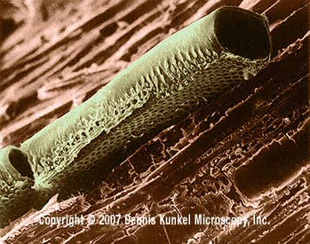

# USABO 2009 Open Exam

### 1. Questions 1 and 2 pertain to the following information:

Sunflower chromosomes have been isolated and their DNA/NT analyzed. It was found that chromosome 2 has unusually high content of Adenine (40%).

How many percent of Guanine is present in chromosome 2?

- [ ] **A.** 10%
- [ ] **B.** 20%
- [ ] **C.** 30%
- [ ] **D.** 40 %
- [ ] **E.** 50%

### 2. Assume that the entire sequence of the chromosome is transcribed.

Which of the following is true for the content of Adenine in the transcribed RNA?

- [ ] **A.** Adenine is 40% of the RNA.
- [ ] **B.** Adenine is 20% of the RNA.
- [ ] **C.** Adenine is at least 20% of the RNA.
- [ ] **D.** Adenine is at least 40% of the RNA.
- [ ] **E.** The content of Adenine is not possible to determine based on the information provided.

### 3. Which of the following is a primary organ or structure of the immune system?

- [ ] **A.** Spleen
- [ ] **B.** Thymus
- [ ] **C.** Tonsils
- [ ] **D.** Lymph nodes
- [ ] **E.** Appendix

### 4. “Hairs” (such as trichomes) on the surface of leaves may limit:

- [ ] **A.** photosynthesis.
- [ ] **B.** intake of carbon dioxide.
- [ ] **C.** evapotranspiration.
- [ ] **D.** drought adaptations.
- [ ] **E.** movement of water in the vessels.

### 5. You discover a worm-like organism that inhabits soil samples that has the following characteristics: segmented body and few bristle-like extensions. To which one of the following groups will you assign this organism?

- [ ] **A.** Cestoda
- [ ] **B.** Polychaeta
- [ ] **C.** Oligochatea
- [ ] **D.** Onychophora
- [ ] **E.** Myriapoda

### 6. Evolution is a product of:

- [ ] **A.** realized niche and biomagnification.
- [ ] **B.** phenotypic variation and selective pressures.
- [ ] **C.** rainfall and temperature.
- [ ] **D.** adaptability within one generation.
- [ ] **E.** extinction and landscape variability.

### 7. Which of the following is NOT true of allosterically regulated enzymes?

- [ ] **A.** Their activity can be modulated by effector molecules.
- [ ] **B.** They demonstrate cooperativity.
- [ ] **C.** Their activity can be modulated by substrate concentration.
- [ ] **D.** They follow Michaelis-Menten kinetics.
- [ ] **E.** Plots of their rate of product formation versus substrate concentration are sigmoidal in shape.

### 8. Why can glycolysis proceed under anaerobic or aerobic conditions while the citric acid cycle only proceeds under aerobic conditions?

- [ ] **A.** Oxygen is a byproduct of the conversion of the glycolytic intermediate glucose-6-phosphate to fructose-6-phosphate.
- [ ] **B.** Enzymes of glycolysis do not use oxygen as cofactors, while enzymes of the citric acid cycle require oxygen for proper folding.
- [ ] **C.** Enzyme catalysis during the citric acid cycle is regulated by allosteric effectors, which include oxygen.
- [ ] **D.** NAD+ is produced during three steps of glycolysis and only one step of the citric acid cycle.
- [ ] **E.** Under anaerobic conditions, NAD+ (for glycolysis) can be regenerated through the conversion of pyruvate into lactate.

### 9. If a child is blood type O, which of the following blood types is IMPOSSIBLE for either parent?

- [ ] **A.** A
- [ ] **B.** B
- [ ] **C.** O
- [ ] **D.** AB
- [ ] **E.** None are impossible

### 10. Which of the following initiates blood clotting?

- [ ] **A.** Mechanical or chemical damage to blood vessel endothelium
- [ ] **B.** Lymphocyte response to pathogen
- [ ] **C.** Conversion of fibrinogen to fibrin
- [ ] **D.** Hemophilia factor XIII
- [ ] **E.** Release of clotting factor I

### 11. Glomerular filtration rate increases if:

- [ ] **A.** a kidney stone obstructs the ureter.
- [ ] **B.** there is efferent arteriolar dilation.
- [ ] **C.** plasma protein concentration decreases.
- [ ] **D.** ATP is released by the macula densa cells.
- [ ] **E.** extracellular volume decreases.

### 12. An individual with rampant untreated type I diabetes is brought to the emergency room. Following an emergency injection of insulin all of the following would occur EXCEPT a:

- [ ] **A.** decrease in the renal clearance of glucose.
- [ ] **B.** decrease in plasma K+.
- [ ] **C.** decrease in blood pH.
- [ ] **D.** decrease in rate of lipolysis.
- [ ] **E.** decrease in respiratory rate.

### 13. Which of the following statements about the cardiac cycle is correct?

A At no time during the cardiac cycle are the mitral and aortic valves both open.

- [ ] **B.** The pressure in the left atrium exceeds that of the left ventricle throughout the ventricular ejection period.
- [ ] **C.** Most filling of the ventricle in diastole in a resting individual occurs with atrial contraction.
- [ ] **D.** The second heart sound is most closely associated with the closure of the left atrioventricular (mitral) valve.
- [ ] **E.** The first heart sound is the result of turbulence associated with ventricular filling.

### 14. During supination the:

- [ ] **A.** humerus is flexed laterally by the action of the triceps brachii.
- [ ] **B.** humerus is adducted by the action of the deltoid.
- [ ] **C.** radius is rotated by the action of the biceps brachii.
- [ ] **D.** ulna is rotated by the action of the brachialis.
- [ ] **E.** ulna and radius rotate around each other through the joint actions of the supinator and coracobrachialis.

### 15. What is the difference between orienting behavior and piloting?

- [ ] **A.** Orienting movements are fast responses to geomagnetic stimuli; piloting is finding a way using familiar landmarks.
- [ ] **B.** Orienting is the ability to follow a compass during navigation; piloting is the ability to use map information during navigation.
- [ ] **C.** Orienting is used during long-distance movements such as migration; piloting is used in short-distance movements involving homing.
- [ ] **D.** Orienting is the ability to use a sun or star compass; piloting is the ability to use a magnetic compass.
- [ ] **E.** Orienting operates only during daylight hours; piloting operates both day and night.

### 16. Which of the following joints are present after birth but absent later in life?

- [ ] **A.** Pubic symphysis
- [ ] **B.** Tibio-fibular fusion joint
- [ ] **C.** Sutures in the skull
- [ ] **D.** Radio-ulnar joint
- [ ] **E.** Epiphyseal plate

### 17. Mice fur coloration is a trait determined from 2 genes positioned on different chromosomes. Gene A has a dominant allele (A) for black color and a recessive allele (a) for white color. The dominant allele of gene B causes white colored fur regardless which of the alleles of A is present. A homozygous dominant mouse was crossed with homozygous recessive mouse. The offspring of this cross (the first filial generation or F1) were self-fertilized. What is the expected ratio of white to black mice in the second filial generation (F2)?

- [ ] **A.** 3 white : 1 black
- [ ] **B.** 13 white : 3 black
- [ ] **C.** 5 white : 3 black
- [ ] **D.** 9 white : 7 black
- [ ] **E.** 1 white : 1 black

### 18. A complication of mitral stenosis (partial blockage of the mitral valve) is the formation of thrombi in the hypertrophic (enlarged) left atrium. On its first pass through the circulatory system (before returning to the right atrium) a thrombus dislodged from the left aspect of the interatrial septum valve may produce all the following EXCEPT:

- [ ] **A.** gangrene in the posterior aspect of the left leg by occluding the profunda femoris (deep femoral) artery.
- [ ] **B.** myocardial infarction by occluding the left coronary artery.
- [ ] **C.** renal infarction by occluding a branch of the right renal artery.
- [ ] **D.** stroke by occluding the basilar artery.
- [ ] **E.** pulmonary embolus by occluding the right pulmonary artery.

### 19. You decide to become an oceanographer and study the productivity of open oceans because they are so important on a global scale. You tell your friend of your intended career switch. Your friend says, “But don’t oceans have the same productivity as deserts? How could they possibly be important on a global scale?” Which of the following statements explains how both you and your friend are correct?

- [ ] **A.** Because oceans occupy such a large percentage (~2/3) of the Earth’s surface area, they contribute nearly half of global net primary productivity (NPP).
- [ ] **B.** The turnover rates or production to biomass (P:B) ratios are greater in the ocean.
- [ ] **C.** There is little biomass per unit area in the ocean.
- [ ] **D.** The photosynthetic populations of oceans are largely plankton forms which have a lower rate of photosynthesis than terrestrial plants.
- [ ] **E.** The nitrogen in the ocean tends to be bound in sediments and thus is unavailable for use in photosynthesis.

### 20. You have discovered a new insect that has the following characteristics: four membranous wings and long slender abdomens.

To which one of the following orders will you assign this insect?

- [ ] **A.** Hymenoptera
- [ ] **B.** Hemiptera
- [ ] **C.** Trichoptera
- [ ] **D.** Odonata
- [ ] **E.** Lepidoptera

### 21. If a strand of DNA has the following nucleotide sequence — ATTCGCTAGACC — what will be the nucleotide sequence of micro RNA (miRNA) be?

- [ ] **A.** UAAGCGAUCUGG
- [ ] **B.** AUUCGCUAGACC
- [ ] **C.** TAAGCGATCAGG
- [ ] **D.** ATTCGCTAGACC
- [ ] **E.** None of the above

### 22. The most significant carbon reservoir (sink) is:

- [ ] **A.** the Amazonian rain forest.
- [ ] **B.** the rainforests of southeast Asia.
- [ ] **C.** the underground petroleum supplies of Siberia.
- [ ] **D.** photosynthetic oceanic microorganisms.
- [ ] **E.** stable isotopes found in igneous rock. The shown family pedigree reflects the inheritance pattern of a rare form of anemia. *

### 23. What is the pattern of inheritance?

- [ ] **A.** Autosomal recessive
- [ ] **B.** Autosomal dominant
- [ ] **C.** X-linked recessive
- [ ] **D.** X-linked dominant
- [ ] **E.** Y-linked dominant

### 24. You are a genetic counselor and a couple has come to you asking your advice. The female of the couple, Jane, has a rare disease of the eye that causes blindness at puberty. In addition, all of Jane's siblings have this disease. Jane's mother has the disease as do both of Jane's maternal uncles and her maternal grandmother. Jane's father does not have the disease nor does Jane's maternal grandfather. The male of the couple, Joe, has no history of this disease in his family. Using only the above information, what is the probability the couple's son will go blind at puberty?

- [ ] **A.** Most likely 100%
- [ ] **B.** Most likely 50%
- [ ] **C.** Most likely 25%
- [ ] **D.** Most likely 12.5%
- [ ] **E.** Most likely 6.25%

### 25. You construct a phylogenic tree of various species of worms you discover at a refuse site using physiological differences. Your collaborator suspects that two groups that seem to be closely related physiologically are in fact significantly different. Which of the following methods would provide the most accurate information to resolve this problem?

- [ ] **A.** Morphological and anatomical comparison of the organisms
- [ ] **B.** Sequencing of mitochondrial DNA from these organisms
- [ ] **C.** DNA restriction mapping of these organisms
- [ ] **D.** Analysis of niche speciation
- [ ] **E.** Analysis by numerical taxonomy

### 26. A patient previously diagnosed with Graves disease (an antibody- mediated autoimmune disorder) comes to your clinic for a routine follow-up exam. Your patient complains of nervousness, fatigue, and diarrhea all of which are worse when they forget to take their medications for Graves. Upon finding a goiter of the thyroid gland, you draw a complete blood screen and assay iodine uptake by the thyroid gland. You expect to find the following:

- [ ] **A.** increased serum TSH, decreased triiodothyronine (T3) and thyroxine (T4) levels, increased iodine uptake by the thyroid gland
- [ ] **B.** decreased T3 and T4, increased serum cholesterol
- [ ] **C.** decreased iodine uptake by the thyroid gland, decreased serum cholesterol
- [ ] **D.** increased calcium, increased serum TSH
- [ ] **E.** decreased serum TSH, decreased T3, increased T4

### 27. What evidence suggests that there is a critical period for song learning in some bird species?

- [ ] **A.** In mynahs and mockingbirds, individuals continue to sing new songs throughout their lives.
- [ ] **B.** Individuals sing songs they are exposed to as juveniles.
- [ ] **C.** Individuals that never hear their species’ specific song, can still sing normally as adults.
- [ ] **D.** Birds that are deafened soon after hatching never sing normally, but birds that are deafened several months after hatching sing normally.
- [ ] **E.** Birds that hatch in the nest of another species will sing the song of that different species.

### 28. A UNIQUE feature of fertilization in angiosperms is that:

- [ ] **A.** it is a double fusion event; one sperm fertilizes the egg, the other sperm combines with the polar or fusion nucleus.
- [ ] **B.** the sperm may be carried by the wind to the female gametophyte.
- [ ] **C.** a pollen tube carries two sperm nuclei into the female gametophyte.
- [ ] **D.** a chemical attractant guides the sperm toward the egg.
- [ ] **E.** the sperm cells have flagella for locomotion.

### 29. Imagine that you are a molecule of RNA polymerase that is sliding along DNA and encountering a gene with typical structure (promoter, coding sequence and terminator) depicted below. Which of the choices below presents the most accurate order of DNA segments (labeled 1, 2, 3……) in which the affinity of the RNA polymerase binding to DNA progressively diminishes?

5’ 3’ 3’ 5’ 1 2 3 4 5 6

- [ ] **A.** 2, 1, 4
- [ ] **B.** 2, 5, 3
- [ ] **C.** 6, 5, 2
- [ ] **D.** 2, 4, 5
- [ ] **E.** 2, 3, 6

### 30. The anatomical structure of the pelvis differs between male and females. Which of the following correctly describes the female pelvis as compared to that of the male? The female pelvis has:

- [ ] **A.** prominent sacrum, wider and rounder pubic arch, true (lesser) pelvis is deeper.
- [ ] **B.** shorter and wider sacrum, oval shaped pelvic inlet, straight coccyx.
- [ ] **C.** ischial spines turn inward, Greater (false) pelvis is shallower, heart shaped pelvic inlet.
- [ ] **D.** curved coccyx, narrow pubic arch, wide greater sciatic notch.
- [ ] **E.** pelvic girdle tilts forward, deep iliac fossa, true (lesser) pelvis is shallower.

### 31. Plant cells maintain their structural integrity partially by &#95;&#95;&#95;&#95;&#95;&#95;&#95;&#95;&#95;&#95;&#95;&#95;&#95;&#95;&#95;&#95; while animal cells maintain structural integrity partially by &#95;&#95;&#95;&#95;&#95;&#95;&#95;&#95;&#95;&#95;&#95;&#95;&#95;&#95;&#95;&#95;&#95;&#95;.

- [ ] **A.** turgor pressure, cholesterol.
- [ ] **B.** high specific heat, cuticle.
- [ ] **C.** cuticle, cholesterol.
- [ ] **D.** cholesterol, turgor pressure.
- [ ] **E.** tightly packed cells, loosely packed cells.

### 32. A person suffering from nerve gas exposure is given atropine to counteract the effects. Why?

- [ ] **A.** Atropine binds to the nerve gas and inactivates it.
- [ ] **B.** Atropine inactivates acetylcholine esterase and allows more acetylcholine to cross the synaptic cleft.
- [ ] **C.** Atropine blocks the acetylcholine receptor which blocks the excess acetylcholine lingering in the synaptic cleft.
- [ ] **D.** Atropine blocks the sites where nerve gas acts.
- [ ] **E.** Atropine stimulates the production of an enzyme that breaks down the nerve gas.

### 33. The protein Fluorollin is made of 3 domains which are tightly packed together when the protein is in its native state. Each of the domains absorbs and emits light at the following wavelengths: Domain A Absorbs: 230-270 nm Emits: 280-310 nm Domain B Absorbs: 290-310 nm Emits: 330-360 nm Domain C Absorbs: 340-360 nm Emits: 390-420 nm If you wanted to determine the subcellular location of properly folded Fluorollin protein by fluorescence microscopy, which of the following emission wavelengths would you monitor if you excite at 240 nm?

- [ ] **A.** 290 nm
- [ ] **B.** 310 nm
- [ ] **C.** 320 nm
- [ ] **D.** 350 nm
- [ ] **E.** 400 nm

### 34. A beaver gnaws through both inner and outer bark, all the way around a tree trunk. Why does this usually cause the eventually death of the tree?

- [ ] **A.** The transport of sugars between leaves and roots is interrupted.
- [ ] **B.** The tree is more susceptible to insect and fungal diseases.
- [ ] **C.** The supply of water and minerals to the leaves is no longer possible.
- [ ] **D.** The transport of sugars between leaves and twigs is interrupted.
- [ ] **E.** Cells of the apical meristem can no longer divide.

### 35. A yeast extract contains all the enzymes required for alcohol production. The extract is incubated under anaerobic conditions in 1 liter of media containing: 200 mM glucose, 20 mM ADP, 40 mM ATP, 2 mM NADH, 2 mM NAD+ and 20 mM Pi (inorganic phosphates). What is the maximum amount of ethanol that can be produced in these conditions?

- [ ] **A.** 2 mM
- [ ] **B.** 20 mM
- [ ] **C.** 40 mM
- [ ] **D.** 200 mM
- [ ] **E.** 400 mM

### 36. Lowering the level of a hedge with a hedge trimmer stimulates the hedge to become bushy because:

- [ ] **A.** it stimulates the production of ethylene gas.
- [ ] **B.** removing the apical meristems makes more auxin which stimulates lateral branch buds to grow.
- [ ] **C.** removing the apical meristems results in less auxin which then allows lateral branches to grow.
- [ ] **D.** removing the apical meristems makes less ethylene which stimulates lateral branches to grow.
- [ ] **E.** removing the lateral buds results in apical dominance under the influence of cytokinins.

### 37. You mow the lawn with a lawn mower and during good growing conditions you soon have to mow it again. This growth is likely due to what growth region?

- [ ] **A.** Cork cambium
- [ ] **B.** Vascular cambium
- [ ] **C.** Basal meristem
- [ ] **D.** Root apical meristem
- [ ] **E.** Shoot apical meristem

### 38. Lawns in the United States take up more land than cultivated corn.

Further:

- [ ] **A.** they do not require fertilizer.
- [ ] **B.** they preserve water resources.
- [ ] **C.** they do not benefit from pesticides.
- [ ] **D.** they do not cause habitat fragmentation.
- [ ] **E.** they require a large amount of resources.

### 39. Several artificial cells are created with various dimensions. Which of the following dimensions would be most conducive to diffusion? A cell with:

- [ ] **A.** surface area of 10 and a volume of 30.
- [ ] **B.** surface area of 8 and a volume of 2.
- [ ] **C.** surface area of 40 and a volume of 30.
- [ ] **D.** surface area of 20 and a volume of 10.
- [ ] **E.** surface area of 5 with a volume of 5.

### 40. The cell shown in the image below is most likely a:

- [ ] **A.** companion cell.
- [ ] **B.** vessel element.
- [ ] **C.** sieve tube element.
- [ ] **D.** sclerid.
- [ ] **E.** fiber.

### 41. Why are there two primary pulmonary arteries leaving the heart and four pulmonary veins returning to the heart?

- [ ] **A.** Pulmonary veins are the primary site of gas exchange.
- [ ] **B.** Rate of blood flow is directly proportional to vessel radius.
- [ ] **C.** Pulmonary venous valves inhibit venous return.
- [ ] **D.** Stenosis (occlusion) of the pulmonary veins is common.
- [ ] **E.** Pulmonary venous return must equal pulmonary arterial outflow.

### 42. Which of the following will result after an extended period of vomiting gastric fluid?

- [ ] **A.** Decreased plasma [HCO3-]
- [ ] **B.** Decreased filtrate pH
- [ ] **C.** Increased excretion of HCO3-
- [ ] **D.** Increased digestion
- [ ] **E.** Onset of post-micturition convulsion syndrome

### 43. During the summer you conduct a study of a thermally stratified lake.

Which of the following statements is acceptable concerning this ecosystem?

- [ ] **A.** H2S concentrations will be the highest at the lowest level of the lake.
- [ ] **B.** The pH of the water in the lake will gradually decrease from the surface of the water to the sediment.
- [ ] **C.** Oxygen concentrations will be the highest at the surface of the water.
- [ ] **D.** Oxidizing bacteria will use the H2S as an energy source.
- [ ] **E.** The temperature of the water in the lake will gradually decrease from the surface of the water to the sediment.

### 44. While hiking in Yellowstone National Park, a 54 year-old man slipped and fell, landing awkwardly on one leg. He experienced sharp pain but was able to drive home where he went to bed. The next morning he awoke in severe pain and had a friend take him to the local emergency room. Upon examining this patient, to what would you MOST LIKELY attribute the swelling, discoloration, and pain in his lateral lower leg?

- [ ] **A.** Torn sciatic nerve
- [ ] **B.** Dislocated hip
- [ ] **C.** Lumbar hernia
- [ ] **D.** Compartment syndrome
- [ ] **E.** Fractured femur

### 45. Joan and Claude come to you seeking genetic counseling. Claude was married before, and he and his first wife had a child with cystic fibrosis, an autosomal recessive condition. A brother of Joan’s died of cystic fibrosis and Joan has never been tested for the gene. If they marry, what is the probability that Joan and Claude will have a son that WILL NOT be a carrier for or have cystic fibrosis?

- [ ] **A.** 1/2
- [ ] **B.** 1/4
- [ ] **C.** 1/12
- [ ] **D.** 1/6
- [ ] **E.** 1/8

### 46. The best description of the relationships between fundamental niches (FN) and realized niches (RN) of two competing species that coexist is:

- [ ] **A.** FNA = RNA; FNB = RN B B
- [ ] **B.** FNA > RNA; FNB = RN B B
- [ ] **C.** FNA < RNA; FNB < RN B B
- [ ] **D.** FNA > RNA; FNB > RN B B B
- [ ] **E.** FNA = RNA; FNS > RNS

### 47. The diagram below represents a section of undisturbed layers of sedimentary rock in New York State and shows the location of fossils of several closely related species. According to currently accepted evolutionary theory, which is the most probable assumption about species A, B and C?

- [ ] **A.** Species B is more abundant than species C.
- [ ] **B.** Species A and B are genetically identical.
- [ ] **C.** Both species A and C are descended from species B.
- [ ] **D.** Species B descended from species A.
- [ ] **E.** Species C existed before species B.

### 48. Population genetics shows us that certain traits of a species will become more abundant if they benefit the species. The diagram below illustrates the change that occurred in the frequency of phenotypes in an insect population over 10 generations. A probable explanation for this change would be that over time there was:

- [ ] **A.** a decrease in the population of this insect.
- [ ] **B.** an increase in the population of this insect.
- [ ] **C.** a decrease in the adaptive value of allele a.
- [ ] **D.** an increase in the adaptive value of allele a.
- [ ] **E.** a decrease in the mutation rate of allele A.

### 49. In the fox, there are 9 coat colors: red, standard silver, Alaskan silver, double-black, smoky red, cross-red, blended-cross, substandard silver, and sub-Alaskan silver. A red fox was crossed with a double-black fox and their offspring were then crossed with each other. The F2 phenotypes were - 10 red : 18 smoky red : 20 cross-red : 39 blended- cross : 9 standard silver : 19 substandard silver : 12 Alaskan silver : 22 sub-Alaskan silver : 8 double-black. How many genes are involved in this cross?

- [ ] **A.** 18 genes
- [ ] **B.** 4 pairs of genes
- [ ] **C.** 9 genes
- [ ] **D.** 9 pairs of genes
- [ ] **E.** 4 genes

### 50. The above pedigree results from a rare SEX-LINKED disease. If individual 1 and 2 have a baby, what is the likelihood that the child denoted by “?”, will have the disease?

- [ ] **A.** 50% if it is a girl; 50% if it is a boy
- [ ] **B.** 0% if it is a girl; 50% if it is a boy
- [ ] **C.** 50% if it is a girl; 0% if it is a boy
- [ ] **D.** 0% if it is a girl; 0% if it is a boy
- [ ] **E.** 0% if it is a girl; 25% if it is a boy

# Answer Key

Extraction method: `plain_key`

| Question | Answer      |
| -------: | :---------- |
|        1 | A           |
|        2 | E           |
|        3 | B           |
|        4 | C           |
|        5 | C           |
|        6 | B           |
|        7 | D           |
|        8 | E           |
|        9 | D           |
|       10 | A           |
|       11 | C           |
|       12 | C           |
|       13 | A           |
|       14 | C           |
|       15 | A           |
|       16 | E           |
|       17 | B           |
|       18 | E           |
|       19 | A           |
|       20 | D           |
|       21 | A OR B      |
|       22 | D           |
|       23 | B OR D      |
|       24 | A           |
|       25 | B           |
|       26 | DISREGARDED |
|       27 | B           |
|       28 | A           |
|       29 | D           |
|       30 | DISREGARDED |
|       31 | A           |
|       32 | C           |
|       33 | A           |
|       34 | A           |
|       35 | B           |
|       36 | C           |
|       37 | C           |
|       38 | E           |
|       39 | B           |
|       40 | B           |
|       41 | E           |
|       42 | C           |
|       43 | A           |
|       44 | D           |
|       45 | B           |
|       46 | D           |
|       47 | E           |
|       48 | D           |
|       49 | B           |
|       50 | B           |
