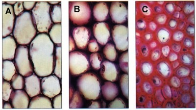
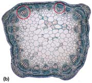
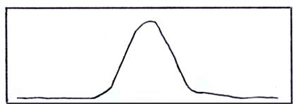
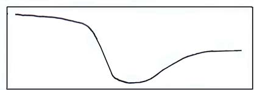
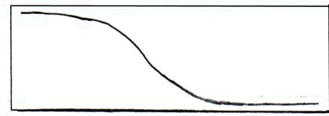
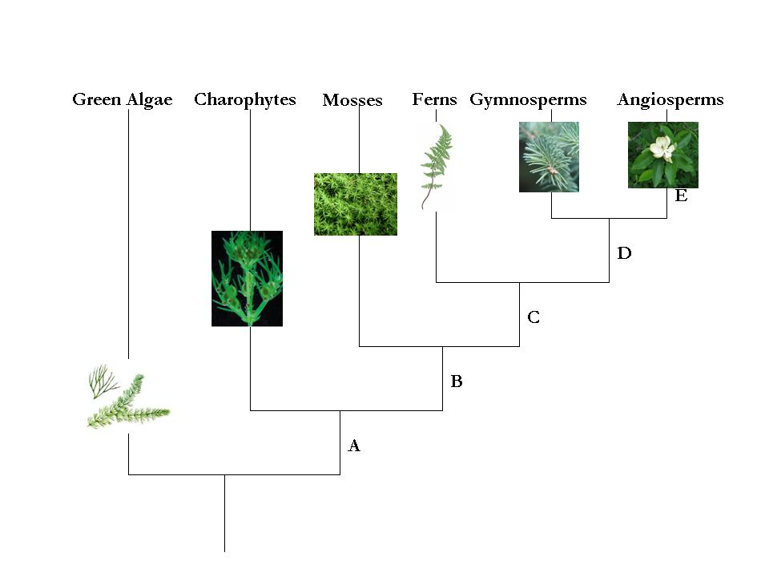
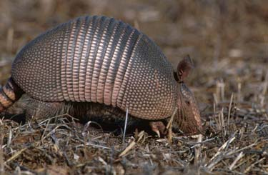

# USABO 2011 Open Exam

### 1. All of the following processes involve hydrogen bonding except:

- [ ] **A.** DNA replication
- [ ] **B.** Formation of ice crystals
- [ ] **C.** Binding of enzyme and substrate
- [ ] **D.** Protein folding
- [ ] **E.** All of the above

### 2. Of the cellular compartments listed below, which has the lowest pH?

- [ ] **A.** Mitochondrial matrix
- [ ] **B.** Endoplasmic reticulum
- [ ] **C.** Lysosome
- [ ] **D.** Cytoplasm
- [ ] **E.** Nucleus

### 3. Listed are three statements about lipids.

1. Lipids are made up of polymers of fatty acids

2. Lipids are hydrophobic

3. Lipids that are made up of fatty acids with a high degree of saturation are more likely to be solids at room temperature Choose the most accurate statement from below:

- [ ] **A.** Statements 1 and 2 are true
- [ ] **B.** Statements 1 and 3 are true
- [ ] **C.** Statements 2 and 3 are true
- [ ] **D.** Only statement 2 is true
- [ ] **E.** All three statements are true

### 4. A spectrophotometer is used to measure concentrations of proteins, DNA and many other chemical compounds. Assume the input light intensity at a particular wavelength λ is I0, and the intensity of the light transmitted through the second cuvette is I1. If the concentration is doubled which of the following statements are TRUE.

- [ ] **A.** The percent transmission of the first sample will be two times greater than the second sample
- [ ] **B.** The absorbance, Aλ, of the second sample will be twice the absorbance of the first sample
- [ ] **C.** The increase in concentration will shift the wavelength of maximum absorbance to a longer wavelength
- [ ] **D.** The percent transmission of the second sample will be twice the first sample
- [ ] **E.** There is insufficient information to determine the correct answer

### 5. What is the concentration of hydrogen ions at pH 5.7? (You do NOT need a calculator.)

- [ ] **A.** 7.0 x 10-5 M H+
- [ ] **B.** 2.0 x 10-6 M H+
- [ ] **C.** 1.0 x 10-5 M H+
- [ ] **D.** 1.0 x 10-6 M H+
- [ ] **E.** 3.0 x 10-5 M H+

### 6. Amino acids and nucleotides form complex polymers. Select ALL the statements that are TRUE (Select all that apply).

- [ ] **A.** Both contain peptide bonds
- [ ] **B.** Both contain nitrogen
- [ ] **C.** Both may form helical structures
- [ ] **D.** Nucleotides and amino acids form branched polymers
- [ ] **E.** Both contain phosphate groups

### 7. A variety of different techniques are used to separate, analyze, and purify different chemical compounds. Select ALL of the following techniques that can be used to estimate the molecular weight of a protein? (Select all that apply)

- [ ] **A.** Isoelectric focusing.
- [ ] **B.** Electrophoresis.
- [ ] **C.** Size exclusion gel chromatography.
- [ ] **D.** Ion-exchange chromatography.
- [ ] **E.** Affinity chromatography.

### 8. Which of the following does not apply to the chloroplast?

- [ ] **A.** Contains chlorophyll and the enzymes required for photosynthesis
- [ ] **B.** Contains an internal membrane system consisting of stack-like structures called thylakoids
- [ ] **C.** Bound by two membranes, the inner of which is folded into the cristae
- [ ] **D.** Bound by one membrane that folds into stoma
- [ ] **E.** Understood to be a product of endosymbiosis

### 9. Use the following pathway to answer Questions 9 and 10. Many metabolic pathways involve multi-step reactions. Consider the following pathway, where E represents different enzymes, and A, B, C, D and F represent substrates and products of the pathway.

`A --E1--> B --E2--> C --E3--> D --E4--> F`

Feedback inhibition of this pathway may involve

- [ ] **A.** The product of the final reaction, F, interacting with and inhibiting E1
- [ ] **B.** F interacting with and inhibiting product B
- [ ] **C.** Product B interacting with and inhibiting E4
- [ ] **D.** Product C interacting with and inhibiting E4
- [ ] **E.** E3 interacting with and inhibiting E2

### 10. In the example above, assume that D is an allosteric inhibitor of the enzyme E2. D would

- [ ] **A.** Compete with B for binding to the E2 active site
- [ ] **B.** Compete with F for binding with E2
- [ ] **C.** Bind directly to the substrate B and prevent it from entering the E2 active site
- [ ] **D.** Bind E2 at a site different from the active site but change the shape of the active site so B can no longer bind
- [ ] **E.** Bind E2 at the active site, change its shape and prevent B from binding the active site

### 11. A plant cell with a solute potential of -0.8 MPa maintains a constant volume when bathed in a solution that has a solute potential of -0.25 MPa and is in an open container. From this information, one knows that:

- [ ] **A.** The cell has a pressure potential of +0.55 MPa
- [ ] **B.** The cell has a pressure potential of +0.25 MPa
- [ ] **C.** The cell has a pressure potential of +0.8 MPa
- [ ] **D.** The cell has a water potential of -0.8 MPa
- [ ] **E.** None of the above answers is correct

### 12. Correctly identify the tissue types A, B, C in the image below:

- [ ] **A.** Sclerenchyma, parenchyma, collenchyma
- [ ] **B.** Collenchyma, parenchyma, sclerenchyma
- [ ] **C.** Collenchyma, sclerenchyma, parenchyma D Parenchyma, collenchyma, sclerenchyma E Parenchyma, sclerenchyma, collenchyma

### 13. Some of the oxygen molecules given off in the process of photosynthesis are used by the plant:

- [ ] **A.** To form water by combining with hydrogen stored in the vacuoles
- [ ] **B.** In cellular respiration in the mitochondria
- [ ] **C.** To build enzymes in the Golgi complex
- [ ] **D.** In transcribing DNA in the lysosome
- [ ] **E.** In membrane-bound amyloplasts to aid in the storage of starch

### 14. How many root meristems do you estimate are on this plant?

- [ ] **A.** 1
- [ ] **B.** 2
- [ ] **C.** 12
- [ ] **D.** 24
- [ ] **E.** 48

### 15. Among flowering plants the details of the morphology of the flower were considered the most important characteristics to determine relatedness because:

- [ ] **A.** Flowers are the most conspicuous part of the plant
- [ ] **B.** Flower structure could easily be observed with a magnifying glass
- [ ] **C.** Flower parts were the easiest to physically measure and accurately describe
- [ ] **D.** Small changes in flower structure could dramatically affect the fertility of the plant
- [ ] **E.** Flower size was not altered by soil properties

### 16. The cross section (b) indicated here is a:

- [ ] **A.** Root
- [ ] **B.** Stem
- [ ] **C.** Leaf petiole
- [ ] **D.** Flower bud
- [ ] **E.** None of the above

### 17. Bacteria including cyanobacteria accumulate a glycogen-like polysaccharide for storing glucose. Which of the following can reasonably explain the evolution of storage polysaccharides?

The common ancestor of plants and animals could synthesize:

- [ ] **A.** Both amylopectin and glycogen, but plants have lost the ability of glycogen synthesis during evolution
- [ ] **B.** Both amylopectin and glycogen, but animals have lost the ability of amylopectin synthesis
- [ ] **C.** Amylopectin but not glycogen, and animals have acquired the ability of glycogen synthesis
- [ ] **D.** Glycogen but not amylopectin, and plants have acquired the ability of amylopectin synthesis

### 18. Suppose you are walking through a deciduous forest. You notice a dead tree that had been cut down and cut into logs that were tagged and labeled for removal from the forest three years prior. You and a friend try to move one of the smaller logs in order to build a camp fire.

You find that the small log is heavy and difficult to move. The mass of the log is actually made-up mostly of:

- [ ] **A.** Water from the soil
- [ ] **B.** Macronutrients from the soil
- [ ] **C.** Micronutrients from the soil
- [ ] **D.** An invisible gas from the air
- [ ] **E.** Membrane-bound cell organelles of the prokaryotes

### 19. During starvation, steroid hormones trigger the transcription of genes for lipid metabolism in their target cells. This would be an example of control by

- [ ] **A.** Negative feedback
- [ ] **B.** Positive feedback
- [ ] **C.** Repressors
- [ ] **D.** Inducers
- [ ] **E.** Modulators

### 20. One fifth of the cardiac output flows through the kidneys. After being filtered by the glomerulus, in what order does the filtrate pass through the following nephric structures?

1. Ascending limb of the Loop of Henle

2. Distal convoluted tubule

3. Descending limb of the Loop of Henle

4. Proximal convoluted tubule

5. Collecting duct

- [ ] **A.** 1, 3, 4, 2, 5
- [ ] **B.** 2, 1, 3, 4
- [ ] **C.** 2, 3, 1, 4, 5
- [ ] **D.** 4, 1, 3, 5
- [ ] **E.** 4, 3, 1, 2, 5

### 21. An animal experiences an acid-base imbalance in the arterial blood that results in acidosis. To increase pH toward normal, which direction would the ventilation rate be changed and what would be the corresponding change in arterial PCO2?

- [ ] **A.** Ventilation rate increases, arterial PCO2 increases
- [ ] **B.** Ventilation rate increases, arterial PCO2 decreases
- [ ] **C.** Ventilation rate decreases, arterial PCO2 increases
- [ ] **D.** Ventilation rate decreases, arterial PCO2 decreases
- [ ] **E.** None of the above

### 22. Which of the following statements about skeletal muscle is NOT correct?

- [ ] **A.** The length (distance) of a single muscle contraction depends on the concentration of Ca2+ ions in the sarcoplasmic reticulum
- [ ] **B.** Muscles with short sarcomeres contract faster than muscles with long sarcomeres
- [ ] **C.** The velocity of muscle contractions is determined by myosin-ATPase activity
- [ ] **D.** Tetanus is the effect of repeated stimulations within a very short interval
- [ ] **E.** Rigor mortis (death rigidity) appears when the concentration of Ca2+ in cytoplasm is high, but ATP is lacking

### 23. The completion of meiosis in males produces four spermatids, each containing (Select all that apply):

- [ ] **A.** 23 chromosomes
- [ ] **B.** 23 pairs of chromosomes
- [ ] **C.** Diploid number of chromosomes
- [ ] **D.** Haploid number of chromosomes
- [ ] **E.** None of the above

### 24. A rat chewing the insulation from the wiring in your car is analogous to:

- [ ] **A.** The depolarization of the unmyelinated axons
- [ ] **B.** The nodes of Ranvier in the PNS
- [ ] **C.** Demyelination of the nervous system
- [ ] **D.** Schwann cells failing to myelinate axons in the CNS
- [ ] **E.** The deterioration of the brain-blood barrier

### 25. Which of the following statement(s) is/are INCORRECT:

1. Cartilage heals slower than skin because cartilage is a deeper tissue

2. The inside lining of the intestine has a large surface area because of the presence of cilia

3. Adipose is a type of connective tissue because that is where fat is stored

- [ ] **A.** #1 and #2 are incorrect
- [ ] **B.** #2 and #3 are incorrect
- [ ] **C.** #1 and #3 are incorrect
- [ ] **D.** All are correct statements
- [ ] **E.** All are incorrect statements

### 26. In the absence of active transport, the passive sodium and potassium ion fluxes across the plasma membrane are still coupled. What makes these two passive ion fluxes dependent on each other?

- [ ] **A.** The potassium channels
- [ ] **B.** The Na+: K+ pumping ratio
- [ ] **C.** The cholesterol: phospholipid ratio in the plasma membrane
- [ ] **D.** The membrane potential, Vm
- [ ] **E.** The relative chemical potentials of sodium ions and potassium ions to the chemical potential of chloride ion

### 27. Which of the following graphs signifies the total cross-sectional area of blood vessels in humans as the blood flows from the aorta -> arteries - > aterioles -> capillaries -> venules -> veins -> venae cavae?

- [ ] **A.** 

- [ ] **B.** 

- [ ] **C.** 

- [ ] **D.** 

- [ ] **E.** 

### 28. Polarity in the developing Drosophila embryo is determined by

- [ ] **A.** A protein gradient of the segmentation protein engrailed
- [ ] **B.** A protein gradient of the bicoid protein expressed from maternal mRNA
- [ ] **C.** A protein gradient of the gap protein hunchback
- [ ] **D.** Expression of the segmentation protein engrailed throughout the embryo
- [ ] **E.** Expression of the gap protein hunchback throughout the embryo

### 29. Although many fish are exothermic, some fish are endothermic.

Which of the following is/are most likely endothermic fish

I. Bluefin tuna

II. Salmon

III. Great white shark

- [ ] **A.** II
- [ ] **B.** I, II
- [ ] **C.** I, III
- [ ] **D.** II, III
- [ ] **E.** I, II, III

### 30. John, 45-years-old, ran his first marathon in Denver, Colorado, with a time of 3 hours and 43 minutes. Running hard at Mile-23, which statement is true?

- [ ] **A.** John’s abdominal muscles increased his intra-abdominal pressure, which is forcing his abdominal viscera upward against his diaphragm. His intrapulmonary pressure at Mile-23 may have decreased by 80 mmHg since the beginning of the marathon
- [ ] **B.** John’s abdominal muscles decreased his intra-abdominal pressure, which is forcing his abdominal viscera upward against his diaphragm. His intrapulmonary pressure at Mile-23 may have increased by 80 mmHg since the beginning of the marathon.
- [ ] **C.** John’s abdominal muscles increased his intra-abdominal pressure, which is forcing his abdominal viscera upward against his diaphragm. His intrapulmonary pressure may have increased by 80 mmHg since the beginning of the marathon
- [ ] **D.** John’s abdominal muscles decreased his intra-abdominal pressure, which is forcing his abdominal viscera upward against his diaphragm. His intrapulmonary pressure may have decreased by 80 mmHg since the beginning of the marathon
- [ ] **E.** John’s abdominal muscles decreased his intra-abdominal pressure, which is forcing his abdominal viscera upward against his diaphragm. His intrapulmonary pressure stayed the same since the beginning of the marathon

### 31. The Costa Rican vampire bat is often not able to acquire blood from a mammal on a given night. Wilkinson (1984) trapped bats which were not allowed to feed for a night and found that they were given regurgitated blood by certain cave-mates. Based on this knowledge, which of the following observations are essential to confirm the occurrence of reciprocal altruism in this species?

Data showing that:

I. Blood is exchanged only between kin

II. Blood is exchanged between non-kin

III. Weak bats are frequently given blood even if they cannot give it to others

IV. Bats who are given blood donate it to those who have given it to them previously

- [ ] **A.** I, II
- [ ] **B.** I, III
- [ ] **C.** II, III
- [ ] **D.** II, IV
- [ ] **E.** III, IV

### 32. The coefficient of relatedness between an uncle and his nephew is:

- [ ] **A.** 0.125
- [ ] **B.** 0.25
- [ ] **C.** 0.5
- [ ] **D.** 1.0
- [ ] **E.** cannot be determined

### 33. Which of the following statements is incorrect regarding hemophilia, a maternally inherited sex linked trait?

- [ ] **A.** A son of a normal non-carrier mother, will not be affected by hemophilia even if the father has the disease.
- [ ] **B.** A daughter of the same parents will be a heterozygous carrier.
- [ ] **C.** Males are considered to be hemizygous.
- [ ] **D.** If a female has a hemophilic gene on one of her chromosomes, she will not show signs of the disease.
- [ ] **E.** A son will be protected from the disease if neither parent shows any symptoms.

### 34. What is the probability of obtaining the given genotype in the offspring AAbbCCdd from the parents AaBbCcDd x AABbCcDd (Assume independent assortment of all gene pairs)?

- [ ] **A.** 1/64
- [ ] **B.** 1/128
- [ ] **C.** 3/128
- [ ] **D.** 9/256
- [ ] **E.** 3/256

### 35. There are n+1 alleles at a particular locus on an autosome. The frequency of one allele is 1/2 and the frequencies of the other alleles are 1/2n. Under the assumption of Hardy-Weinberg equilibrium, what is the total frequency of heterozygotes?

- [ ] **A.** n-1/2n
- [ ] **B.** 2n-1/3n
- [ ] **C.** 3n-1/4n
- [ ] **D.** 4n-1/5n
- [ ] **E.** 5n-1/6n

### 36. Natural selection is effective in the evolutionary processes because it:

- [ ] **A.** Causes evolution.
- [ ] **B.** Changes allele frequencies.
- [ ] **C.** Changes genotype frequencies.
- [ ] **D.** Leads to fixation or loss of particular alleles.
- [ ] **E.** Increases the mean fitness of a population.

### 37. Which of the following populations is most likely to be close to Hardy- Weinberg equilibrium?

- [ ] **A.** The human population of Toronto, Canada.
- [ ] **B.** A population of 100 fruit flies living in a habitat with little environmental fluctuation that has no other populations of fruit flies nearby.
- [ ] **C.** A population of 1 million fruit flies living in a habitat with little environmental fluctuation that has many other populations of fruit flies nearby.
- [ ] **D.** A population of 100 fruit flies living in a habitat with little environmental fluctuation that has many other populations of fruit flies nearby.
- [ ] **E.** A population of 1 million fruit flies living in a habitat with little environmental fluctuation that has no other populations of fruit flies nearby.

### 38. Darwin’s Finches are a prime example of adaptive radiation. Which of the following best describes this adaptive radiation correctly?

- [ ] **A.** The genetic variability that can be found among individuals of the same species
- [ ] **B.** The evolutionary process by which different forms, adapted to different niches arose from a common ancestor
- [ ] **C.** A sudden diversification of a group of organisms from closely related species
- [ ] **D.** The evolutionary process that allows for the changes that occur within the same lineage
- [ ] **E.** The evolutionary process of adaptation of species through a form of polymorphism

### 39. A species of insect was found to have a resistance to a commonly used insecticide. Which of the following is the most likely explanation?

- [ ] **A.** Stabilizing selection caused development of resistance in the insect population
- [ ] **B.** The original gene pool included genes that conferred resistance to the insecticide
- [ ] **C.** The insecticide stimulated development of resistance in certain individuals and this was inherited
- [ ] **D.** The insecticide caused a mutation that was favorable to resistance and this was inherited

### 40. Progressive change toward a climax in a community is called:

- [ ] **A.** Evolutionary change
- [ ] **B.** Succession
- [ ] **C.** Energy flow
- [ ] **D.** Dynamic equilibrium
- [ ] **E.** None of the above

### 41. Which of the following would you expect to happen if a bacterial cell lacked restriction enzymes?

- [ ] **A.** Bacteriophages could easily infect and lyse the cell
- [ ] **B.** Incomplete plasmids would be the cell’s products
- [ ] **C.** Replication would not be possible
- [ ] **D.** The bacteria would be an obligate parasite
- [ ] **E.** Both C and D

### 42. Replacement of a lysine with a glycine in a protein could result in all of the following EXCEPT a:

- [ ] **A.** Change in the quaternary structure of the protein
- [ ] **B.** Change in the secondary structure of the protein
- [ ] **C.** Loss of catalytic activity of the protein
- [ ] **D.** Loss of a negatively charged side chain
- [ ] **E.** Loss of the protein’s ability to interact with other proteins

### 43. The biodiversity of a community is measured by the following:

- [ ] **A.** Species richness.
- [ ] **B.** Relative abundance.
- [ ] **C.** Total biomass in a given area.
- [ ] **D.** Ratio of plant to animal species.
- [ ] **E.** Both A and B are metrics of biodiversity.

### 44. Earth’s four major terrestrial biomes are

- [ ] **A.** Forest, taiga, grassland, desert
- [ ] **B.** Forest, grassland, tundra, desert.
- [ ] **C.** Forest, grassland, savanna, desert
- [ ] **D.** Savanna, forest, grassland, tundra
- [ ] **E.** Savanna, taiga, grassland, estuary

### 45. Which two major climatic factors dictate what kind of vegetation is found on the landscape?

- [ ] **A.** Temperature and latitude
- [ ] **B.** Temperature and precipitation
- [ ] **C.** Temperature and soil type
- [ ] **D.** Precipitation and soil type
- [ ] **E.** Precipitation and solar angle

### 46. In a forest, a group consisting of all the maple trees would be considered a:

- [ ] **A.** Population
- [ ] **B.** Community
- [ ] **C.** Ecosystem
- [ ] **D.** Biome
- [ ] **E.** None or all of the above

### 47. Among plants, long-term survival depends mostly on competition for:

- [ ] **A.** Water
- [ ] **B.** Air
- [ ] **C.** Minerals
- [ ] **D.** Light
- [ ] **E.** All or none of the above

### 48. In the phylogenetic tree of green plants below, indicate the branch (A to E) where traits I and IV are acquired?

I. Pollen

II. Tracheid

III. Cuticle

IV. Seed

V. Carpel

VI. Multicellular embryo

### 49. Although the armadillo has a leather coat like a reptile, it is classified as a mammal due to the presence of mammary glands. Which of the following additional features support its inclusion in the class Mammalia?

Armadillo

I. Hair over parts of the body.
II. Presence of pituitary and thyroid gland.
III. Complete separation of pulmonary and systemic circulation in a 4 -chambered heart.
IV. A diaphragm separating thoracic and abdominal cavities.
V. Regulation of body temperature irrespective of ambient temperature.
VI. Enucleated red blood cells.

- [ ] **A.** III and VI
- [ ] **B.** I, IV and V
- [ ] **C.** I and IV
- [ ] **D.** I and II, and III
- [ ] **E.** I, III, IV, and VI

### 50. A valid taxonomic group for the cladogram shown above would include:

- [ ] **A.** Tamarin + Squirrel
- [ ] **B.** Tamarin + Squirrel + Howler
- [ ] **C.** Squirrel + Howler + Wooly
- [ ] **D.** Wooly + Spider + Howler
- [ ] **E.** All are valid groups

# Answer Key

Extraction method: `plain_key`

| Question | Answer |
|---:|:---|
| 1 | E |
| 2 | C |
| 3 | C |
| 4 | B |
| 5 | B |
| 6 | B+C |
| 7 | B+C |
| 8 | DISREGARDED |
| 9 | A |
| 10 | D |
| 11 | A |
| 12 | D |
| 13 | B |
| 14 | C |
| 15 | D |
| 16 | B |
| 17 | D |
| 18 | D |
| 19 | D |
| 20 | E |
| 21 | B |
| 22 | A |
| 23 | A+D |
| 24 | C |
| 25 | E |
| 26 | D |
| 27 | A |
| 28 | B |
| 29 | C |
| 30 | A |
| 31 | D |
| 32 | B |
| 33 | E |
| 34 | B |
| 35 | C |
| 36 | E |
| 37 | E |
| 38 | B |
| 39 | B |
| 40 | B |
| 41 | A |
| 42 | D |
| 43 | E |
| 44 | B |
| 45 | B |
| 46 | A |
| 47 | D |
| 48 | D |
| 49 | E |
| 50 | D |
