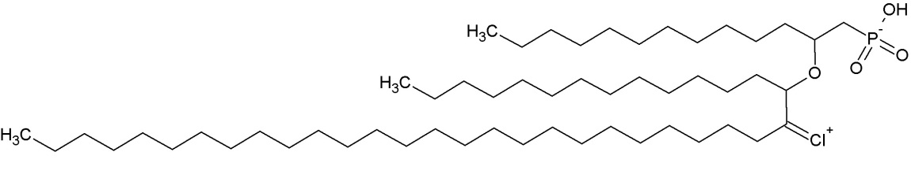
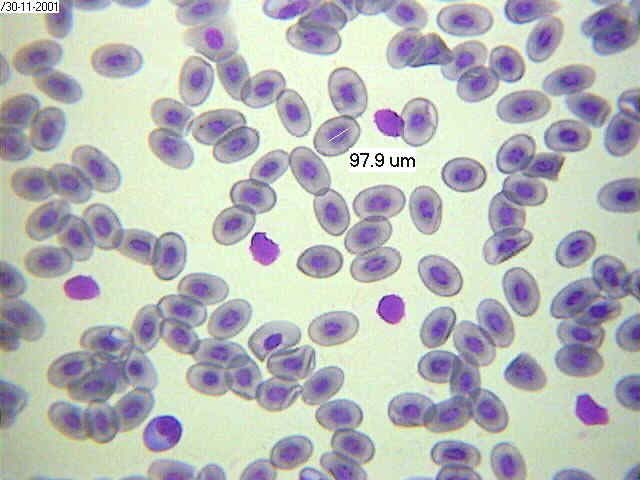
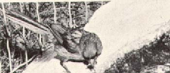
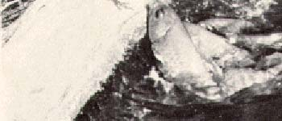

# USABO 2012 Open Exam

## Question 1

Rank the following biological molecules in order of how readily they diffuse across the plasma membrane from the most diffusible to the least diffusible.

I. CO2
II. Cl-
III. Sucrose
IV. Glycerol

- A. I, III, IV, II
- B. II, IV, III, I
- C. III,II, IV, I
- D. I, IV, III, II
- E. II, I, III, IV

## Question 2

You perform a Western blot on two proteins of similar molecular weights (~50kDa) and find only one band developed on your SDS-PAGE gel. How would you modify your assay to distinguish the two proteins?

- A. Use a lower concentration of acrylamide to raise the resolution of your gel
- B. Use a non-ionic detergent to denature your protein
- C. Focus your sample isoelectrically on a pH gradient
- D. Remove reducing agents like mecaptoethanol or dithiothreitol
- E. Switch the anode and cathode on your gel

## Question 3

The tiny hairs on a gecko's toes enable it to climb walls. The hairs are made of hydrophobic keratin and adhere to surfaces via van der Waals interaction. At the tiny interface where the gecko's toe hairs touch the surface it climbs, which amino acid are you LEAST likely to find?

- A. Isoleucine
- B. Leucine
- C. Valine
- D. Phenylalanine
- E. Serine

| Choice | Structure |
|---|---|
| A. Isoleucine |  |
| B. Leucine |  |
| C. Valine |  |
| D. Phenylalanine |  |
| E. Serine |  |

## Question 4

When found on the extracellular side of the cell, which of the following classes of membrane molecules is a marker for the phagocytosis of apoptotic cells?

- A. Glycolipid
- B. Sphingomyelin
- C. Phosphatidylethanolamine
- D. Phosphatidylserine
- E. Phosphatidylcholine

## Question 5

The presence of which of the following amino acids in the channel region of aquaporins contributes to the electrostatic selectivity to allow water, but not other molecules, to pass through?

- A. Valine
- B. Tryptophan
- C. Asparagine
- D. Methionine
- E. Leucine

## Question 6

While preparing to teach an organic chemistry class, Professor Dacb has managed to mix up several beakers. He has taken samples from each beaker and enlisted your help in identifying them. Below are the results of a series of reagent tests.

| Beaker | Biuret | Benedict's | Ninhydrin | Iodine | Sudan |
|---:|---|---|---|---|---|
| 1 | Blue | Blue | Blue | Orange | Rather pale |
| 2 | Blue | Blue | Pale yellow | Red-orange | Red-orange |
| 3 | Purple | Blue | Pale yellow | Orange | Rather pale |
| 4 | Blue | Red precipitate | Pale yellow | Orange-yellow | Rather pale |
| 5 | Blue | Blue | Pale yellow | Orange | Rather pale |

Which of the following correctly matches each beaker to its possible contents?

- A. 1: Gelatin, 2: Corn oil, 3: A solution of asparagine, 4: A solution of glucose, 5: A solution of sucrose
- B. 1: Gelatin, 2: Triglycerides, 3: A solution of asparagine, 4: A solution of sucrose, 5: A solution of glucose
- C. 1: A solution of asparagine, 2: Triglycerides, 3: Gelatin, 4: A solution of glucose, 5: A solution of sucrose
- D. 1: A solution of sucrose, 2: Corn oil, 3: A solution of glucose, 4: A solution of asparagine, 5: Gelatin
- E. 1: A solution of glucose, 2: Triglycerides, 3: A solution of sucrose, 4: A solution of asparagine, 5: Gelatin

## Question 7

There are some rare organisms that do not have lipid bilayers, but instead have lipid monolayers. Which of these is a plausible structure for the lipids they use to make up their lipid monolayers?

| Choice | Structure |
|---|---|
| A |  |
| B |  |
| C |  |
| D |  |
| E |  |

## Question 8

One of your classmates has symptoms of protein deficiency. You suspect that she might have a mineral deficiency due to her diet of nothing but canned spaghetti. Which of the following minerals should you test for first?

- A. Iron
- B. Copper
- C. Manganese
- D. Molybdenum
- E. Sulfur

## Question 9

A new therapeutic drug can treat the symptoms of the demyelinating disease multiple sclerosis (MS) by blockage of voltage-gated potassium channels. Neuron action potential conduction improves because:

- A. More potassium is allowed to enter the axon which increases the amplitude of the action potential
- B. The high resting leak of potassium out of the axon is minimized
- C. Less potassium is allowed to leave the axon which increases the size and duration of the action potential
- D. Less potassium is allowed to leave the axon which prevents the inactivation of voltage-gated sodium channels increasing the amplitude of the action potential
- E. The resistance of the plasma membrane decreases which increases the amplitude of the action potential

## Question 10

Which component of Fick’s Law of Diffusion is MOST optimized in the ventilation of fish gills compared to mammalian lungs?

- A. Diffusion coefficient
- B. Gradient for diffusion
- C. Surface area
- D. Path length
- E. Temperature

## Question 11

Pollen grains were treated with colchicine in culture. The resulting plants were

- A. No more than large calluses
- B. Dihaploid and fertile
- C. Dihaploid and sterile
- D. Haploid and sterile
- E. Haploid and fertile

## Question 12

Which of the following statements about seeds is FALSE?

- A. Coleorhizae are found in monocotyledonous seeds
- B. Both monocotlyedonous and dicotyledonous seeds have radicles
- C. Both monocotlyedonous and dicotyledonous seeds have a pericarp
- D. The coleoptile is found only in monocotyledonous seeds
- E. The aleurone layer is found only in dicotyledonous seeds

## Question 13

Which of the following terms describes the closing of leaves or flowers at night?

- A. Epinasty
- B. Nyctinasty
- C. Seismonasty
- D. Thermonasty
- E. Thigmonasty

## Question 14

Which of the following statements about carnivorous plants is FALSE?

- A. All carnivorous plants are angiosperms.
- B. All carnivorous plants are evolved for nutrient-poor environments.
- C. All carnivorous plants are limited to small arthropods or, in the case of bladderwort, zooplankton as prey.
- D. All carnivorous plants have mechanisms to attract and capture prey.
- E. All carnivorous plants derive energy from trapping and consuming arthropods and/or zooplankton

## Question 15

Roots absorb cations from the soil by a process called:

- A. Cation absorption
- B. Cation exchange
- C. Cation transfer
- D. Cation cotransport
- E. Cation reduction

## Question 16

Which of the following statements about plant stomata is TRUE?

- A. When the guard cells are filled with water and turgid, the stoma is closed.
- B. Cellulose microfibrils are oriented along the longer axis of guard cells.
- C. After a certain point, stomata closure is irreversible.
- D. Stomata open with the active uptake of K+ ions by the guard cells.
- E. Only CO2 depletion contributes to stomatal opening.

## Question 17

Which of the following features of flowers is NOT meant to facilitate its pollination by animals?

- A. The production of nectar at the base of the flower.
- B. The presence of leaf-like sepals.
- C. Brightly-colored and conspicuous petals.
- D. A strong odor of rotting meat.
- E. Patterns only visible under ultraviolet light.

## Question 18

The food source of Rhizopus stolonifer (black bread mold, a zygomycete) has been depleted.

Which of these is most likely to happen?

- A. Zygosporangia form.
- B. Mycelia increase the rate of asexual reproduction.
- C. Mycelia produce conidia (pigmented haploid spores).
- D. The Rhizopus forms mycorrhizal interactions with root plants.
- E. The Rhizopus forms flagellated zoospores to spread via aquatic transportation.

## Question 19

Stressful stimuli cause a number of physiological reactions. Which of the following is NOT a correctly matched statement about stress-related hormones?

- A. Epinephrine - Stimulate glucose production from glycogen
- B. Mineralocorticoids - Increase blood pressure and volume
- C. Glucocorticoids - Reduce immune system activity
- D. Norepinephrine - Increase breathing rate
- E. ACTH - Stimulate adrenal medulla to secrete hormones

## Question 20

Which one of these hormones is NOT secreted by the anterior pituitary gland?

- A. Growth hormone
- B. Prolactin
- C. Antidiuretic hormone
- D. Luteinizing hormone
- E. Adrenocorticotropic hormone

## Question 21

A patient presents the following symptoms: diarrhea, dermatitis, and dementia, as well as “necklace” lesions on the lower neck, hyperpigmentation, thickening of the skin, inflammation of the mouth and tongue, digestive disturbances, amnesia, and delirium.

Which of the following is deficient in this person’s system?

- A. Vitamin D3 (cholecalciferol)
- B. Vitamin B3 (niacin)
- C. Vitamin C (ascorbic acid)
- D. Vitamin B1 (thiamine)
- E. Vitamin E (tocopherol)

## Question 22

Which of the following membranes is/are responsible for respiration in developing birds and reptiles?

- A. Amnion
- B. Allantois
- C. Chorion
- D. A and C
- E. B and C

## Question 23

What is the primary source of food for developing zebrafish larvae up to 5 days post fertilization (dpf)?

- A. Yolk Sac
- B. Larval fish food flakes
- C. No food required
- D. Paramecium

## Question 24

The virus Ijustmadethisup causes the following symptoms: overly fragile bones, fatigue, bone pain, an abnormal EKG with a short QT interval and a long T wave, kidney stones, constipation, and vomiting. You theorize that the virus is infecting endocrine cells and causing the overproduction of a certain hormone. Which hormone should you test for first?

- A. Prolactin
- B. Parathyroid hormone (PTH)
- C. Triiodothyronine
- D. Melatonin
- E. Oxytocin

## Question 25

The flippers of dolphins are exposed to cold water away from the main mass of the body and employ countercurrent heat exchange. Which of the following statements is FALSE?

- A. Each artery in the flipper is surrounded by several veins, allowing efficient heat exchange.
- B. As long as there is a difference in temperatures, heat transfer occurs from the warmer vessel to the cooler one.
- C. The coolest blood is found at the tip of the dolphin flipper.
- D. Dolphins are the only mammals known to employ countercurrent heat exchange.
- E. Once the arterial blood has been cooled past a certain point, it will no longer transfer heat to the veins.

## Question 26

The diagram above depicts:

- A. Developing human sperm cells
- B. Human blood smear
- C. Human lung section
- D. Frog eggs
- E. Frog blood smear

## Question 27

Which statement best explains why the ascending limb of the loop of Henle is thicker than the descending limb?

- A. Many cells with aquaporin are present in the ascending limb
- B. The ascending limb receives a better blood supply
- C. The triple-pumps (Na+/K+/Cl-) of the ascending limb consume a lot of ATP and need many mitochondria.
- D. Unexplained proliferation of cells around the ascending limb
- E. Descending limb has evolved completely while the thickness of the ascending limb is a vestigial feature.

## Question 28

A child has overdosed on acetaminophen, causing acute liver failure. He displays symptoms of severe jaundice and swelling of the abdomen. Which of the following processes is not directly impacted?

- A. Bile synthesis
- B. Bilirubin glucuronidation
- C. Production of serum albumin
- D. Erythropoietin synthesis
- E. Glycogenesis

## Question 29

Fixation is a lab procedure used to prevent biological tissues from decay. In instances where perfect morphology of the whole animal is desired, cardiac fixation is the preferred method.

Where should the researcher inject the fixative to ensure the best results?

- A. Right atrium
- B. Abdominal cavity
- C. Right ventricle
- D. Left atrium
- E. Left ventricle

## Question 30

What is the primary mechanism by which ADH exerts its effects on the kidney?

- A. Formation of water-impermeable junctions by the podocytes of nephron glomeruli
- B. Decreasing circulatory flux through renal afferent arterioles
- C. Raising the osmolarity of nephron medullae to ~1500 mosm/L
- D. Increasing expression of aquaporins in the distal convoluted tubule
- E. Synthesis of additional cation pumps in the ascending Loop of Henle

## Question 31

In the picture below – taken from the work of N. Tinbergen – a cardinal feeds minnows, which rose to the surface looking for food. The bird fed the fish for several weeks, probably because its nest had been destroyed.

The cardinal’s behavior is best understood as:

- A. Habituation
- B. Imprinting
- C. Fixed action pattern
- D. Associative learning
- E. Operant conditioning

## Question 32

Which of the following is an example of habituation?

- A. Chickadees learning new songs when they shift from living in small groups to living in large winter flocks.
- B. Lion cubs stalking and attacking litter mates
- C. Hydra initially contracting when gently touched, and then soon stopping to respond
- D. Golden plovers migrating yearly from Arctic breeding grounds to southeastern South America
- E. A mother eagle flying beneath her young to prevent them from falling

## Question 33

By convincing soldiers that they are part of a "brotherhood," and thus increasing the likelihood that they will protect, and even die for each other, the military is—consciously or unconsciously—tapping into genes that were adaptive in our ancestors due to

- A. Individual selection
- B. Kin selection
- C. Neoteny
- D. Inclusive selection
- E. Heterochrony

## Question 34

A certain plant you are studying has alleles R and r for pointed and round leaves, and alleles B and b for blue and white petals. You perform a cross between homozygous dominant (RRBB) and homozygous recessive (rrbb) plants. The offspring are then crossed with a homozygous recessive (rrbb) plant. You observe the results. 1600 offspring are produced.

Which of the following data is CLOSEST to what you would expect given a recombination frequency of 25%?

- A. 100 rrbb, 300 rrBb, 300 Rrbb, 900 RrBb
- B. 600 rrbb, 600 rrBb, 200 Rrbb, 200 RrBb
- C. 200 rrbb, 200 rrBb, 600 Rrbb, 600 RrBb
- D. 900 rrbb, 300 rrBb, 300 Rrbb, 100 RrBb
- E. 600 rrbb, 200 rrBb, 200 Rrbb, 600 RrBb

## Question 35

In birds, the keel is an extension of the sternum where the powerful pectoral flight muscles attach. Which of the following orders of birds is most likely to have a reduced keel?

- A. Piciformes
- B. Anseriformes
- C. Sphenisciformes
- D. Struthioniformes
- E. Galliformes

## Question 36

What provides the best evidence for the independent origin of microphylls and megaphylls?

- A. Microphylls have a single unbranched vein, while megaphylls have a branching vascular system
- B. Microphylls have a branching vascular system, while megaphylls have a single unbranched vein
- C. Microphylls are small, while megaphylls are larger
- D. Both are vascularized
- E. Both appear as lateral appendages

## Question 37

A male child with Klinefelter’s syndrome is found to be color-blind (a recessive X-linked trait). Both the mother and father have normal vision. How can this be explained?

- A. Nondisjunction during the mother’s meiosis I
- B. Nondisjunction during the mother’s meiosis II
- C. Nondisjunction during the father’s meiosis I
- D. Nondisjunction during the father’s meiosis II
- E. Failure of X inactivation in the child

## Question 38

Birds and mammals share all the following characteristics EXCEPT:

- A. Amniotic eggs
- B. A notochord
- C. Bi-directional breathing
- D. Endothermy
- E. A four-chambered heart

## Question 39

Which of these is NOT true about allopatric speciation?

- A. It describes formation of a new species due to geographic isolation
- B. It is more rare than sympatric speciation
- C. It can be caused by sexual selection
- D. It can be caused by natural selection under different environmental conditions
- E. It can prevent interbreeding with the parent population

## Question 40

Which of the following is NOT true about genetic drift?

- A. Can cause harmful alleles to become fixed
- B. Can cause allele frequencies to change at random
- C. Significant in small populations
- D. Can lead to a loss of genetic variation within populations
- E. Prevents allele frequencies from fluctuating over time

## Question 41

An individual with Turner Syndrome would have which of the following sex chromosomes arrangements?

- A. XO
- B. XXYY
- C. XXXXY
- D. YO
- E. XXX

## Question 42

When the base composition of DNA from bacterium Fusobacterium novum was determined, 32% of the bases were found to be guanine. What is the pyrimidine content?

- A. 18%
- B. 32%
- C. 50%
- D. 64%
- E. 72%

## Question 43

From which geological period over 500 million years ago did fossils first show all of the major body plans we see today?

- A. Burgess period
- B. Cambrian period
- C. Carboniferous period
- D. Cretaceous period
- E. Ediacaran period

## Question 44

Robert MacArthur and E. O. Wilson studied island biogeography and developed the island equilibrium model. Which of the following scenarios will DEFINITELY result in an island X having a greater equilibrium number of species than island Y?

- A. Island X is bigger than Island Y. The two islands are the same distance from the mainland.
- B. Island X is farther from the mainland than Island Y. The two islands are the same size.
- C. Island X is bigger than Island Y and farther from the mainland.
- D. Island X is smaller than Island Y and closer to the mainland.
- E. Island X and Y have the same rate of immigration and extinction.

## Question 45

Which of the following is NOT an adaptation to survival in a grassland biome?

- A. Grasses have basal meristems that allow them to grow from the base of the plant instead of the tip.
- B. Trees retain their moisture below the ground and have bark that lacks resin or cork.
- C. Grasses have deep roots to anchor them and provide starch reserves.
- D. Grasses have bulliform cells that can change in turgor pressure allowing the plant to furl its blade and shelter its stomata.
- E. Grazing animals have long distance vision with eyes placed well above their snouts.

## Question 46

In many bird and mammal species, more often males have secondary sexual characters like the antlers of the deer or colored plumage in birds and/or perform elaborate courtship displays in order to attract females for copulations. Why do you think females are often said to be the ‘choosy’ sex?

- A. Sperm production by the male is more expensive than egg production by the females, so they can invest more time in mate choice.
- B. The embryo usually develops inside females until birth or egg laying. This involves a great amount of energy and causes females to be choosy.
- C. Males produce much more sperm than females produce eggs. The limited gamete production by females makes them more choosy than males.
- D. A, B and C
- E. B and C

## Question 47

Males of a small tropical bird species spend 6 months of the year jumping around in a small area on the forest floor exposing their bright yellow beard during landing. Males don’t contribute anything other than sperm to the production of their offspring. Which of the following statements best explains why males display themselves in such an obvious manner that also would make them an easy prey?

- A. Males that display more frequently and move faster obtain more matings, as females use displaying capabilities as indicators of male quality on which they base their mate choice.
- B. Males that display more frequently and faster obtain less matings, as females prefer males that perform such displays as little and slow as possible so they don’t get eaten by predators.
- C. Males that perform the courtship behavior more frequently and faster obtain more matings as this is direct evidence of good male genetic quality important for healthy offspring.
- D. Males perform such noisy and startling behaviors as there are very few predators in the tropics.
- E. Males that display more frequently and move faster are selected for because displays improve their chance of survival.

## Question 48

Sexual selection is a case of natural selection that describes evolution due not to variable survival rates due to fitness, but rather due to variable reproductive rates stemming from characteristics that allow an individual to successfully attract a mate. These traits are called secondary sexual characters. Which answer is NOT a correct statement about secondary sexual characteristics?

- A. The peacock’s tail is a secondary sexual character.
- B. Reproductive organs are secondary sexual characters.
- C. Bird song can be used for mate attraction.
- D. The roaring of deer can be used for mate attraction.
- E. Sexual selection can select for traits that decrease individuals’ likelihood of survival.

## Question 49

You observe an animal in the early stages of development. The zygote divides radially into eight cells. If you separate these early cells, each one can successfully develop into an animal on its own and the coelom forms from an infolding pocket of the archenteron. Which of the following is a valid candidate for the animal you are observing?

- A. Horseshoe crab (Chelicerata)
- B. Fruit fly (Insecta)
- C. Sea urchin (Echinoidea)
- D. Land snail (Gastropoda)
- E. Earthworm (Oligochaeta)

## Question 50

Which of the following classes contains organisms lacking a closed circulatory system?

- A. Polychaetes
- B. Cephalopoda
- C. Insecta
- D. Reptilia
- E. Eutheria

# Answer Key

Extraction method: `yellow_highlight`

| Question | Answer |
|---:|:---|
| 1 | D |
| 2 | C |
| 3 | E |
| 4 | D |
| 5 | C |
| 6 | C |
| 7 | D |
| 8 | E |
| 9 | C |
| 10 | B |
| 11 | B |
| 12 | E |
| 13 | B |
| 14 | C |
| 15 | B |
| 16 | D |
| 17 | B |
| 18 | A |
| 19 | E |
| 20 | C |
| 21 | B |
| 22 | E |
| 23 | A |
| 24 | B |
| 25 | D |
| 26 | E |
| 27 | C |
| 28 | D |
| 29 | E |
| 30 | D |
| 31 | C |
| 32 | C |
| 33 | B |
| 34 | E |
| 35 | D |
| 36 | A |
| 37 | B |
| 38 | C |
| 39 | B |
| 40 | E |
| 41 | A |
| 42 | C |
| 43 | B |
| 44 | A |
| 45 | B |
| 46 | E |
| 47 | A |
| 48 | B |
| 49 | C |
| 50 | C |
