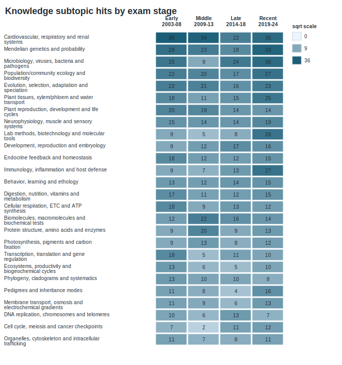
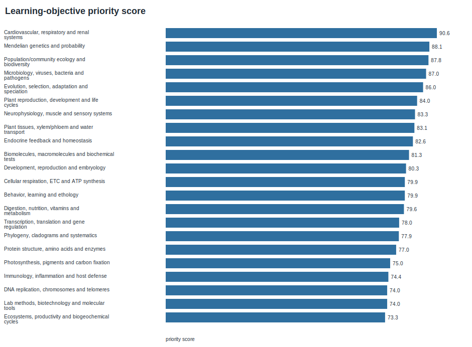
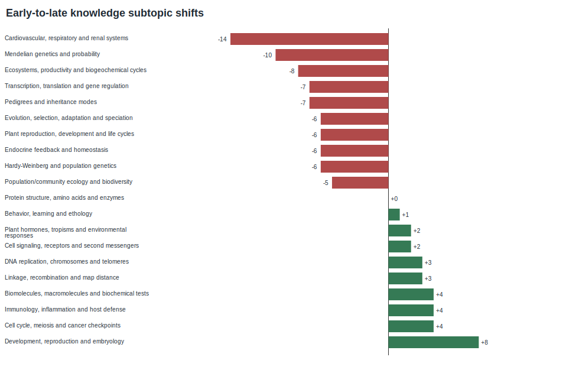
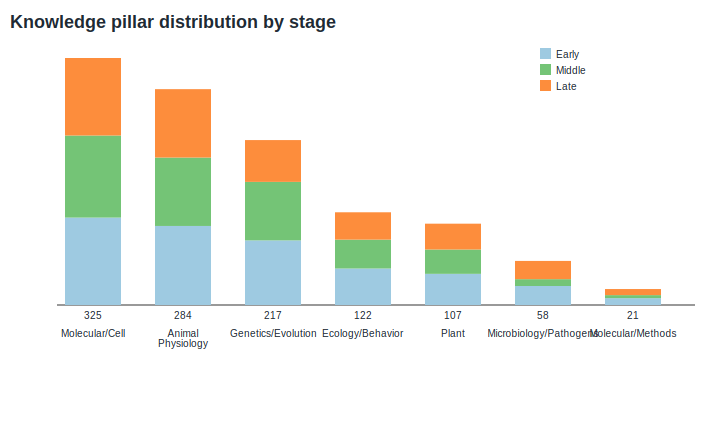
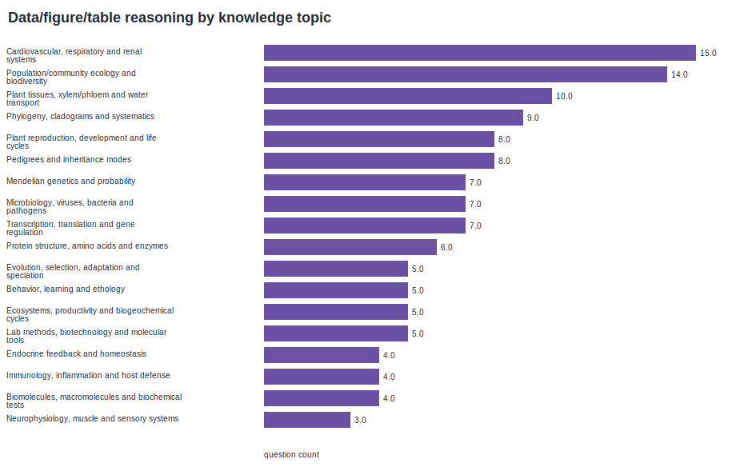
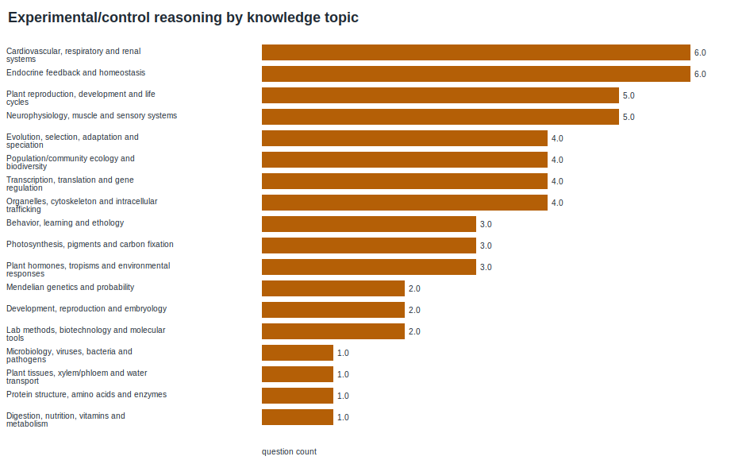
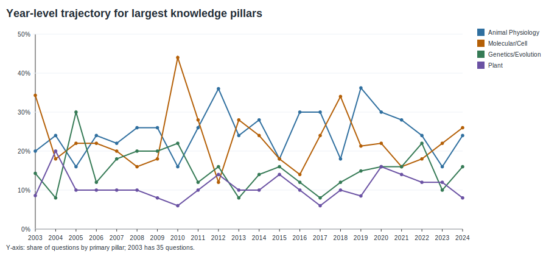
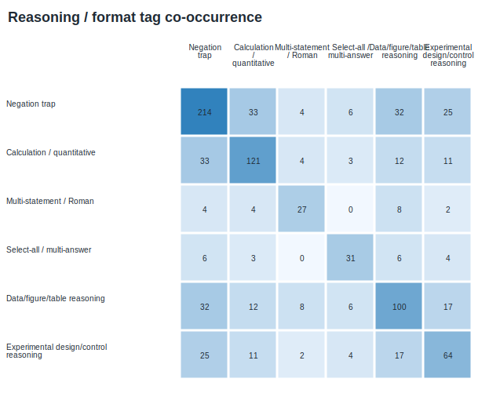
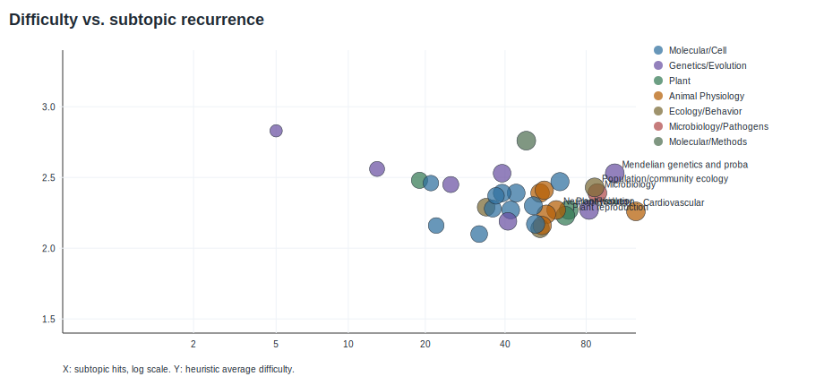

# Consolidated USABO Open Exam Subtopic Analysis, 2003-2018

Generated from local files in `raw/markdown` and the three existing reports in `raw/markdown/analysis` on 2026-05-05. No web search or remote model APIs were used.

## Purpose

This document consolidates the three prior analyses:

- `open_exam_analysis_chatgpt.md`: measured year-by-year structure, topic counts, format features, and answer-key issues.
- `open_exam_analysis_claude.md`: stable subtopics, mechanism-oriented solving, distractor taxonomy, and BioBloom generation parameters.
- `open_exam_analysis_gemini.md`: high-level exam evolution and student preparation narrative.

The new layer here is deeper subtopic prioritization. Unlike the previous version, broad skills such as data interpretation and experimental design are not treated as standalone knowledge topics. They are reasoning dimensions attached back to concrete biology subtopics.

## Saved Reproducibility Artifacts

- Generator code: `code/generate_consolidated_subtopic_analysis.py`
- Question-level tags: `data/open_exam_subtopic_question_tags.jsonl`
- Subtopic summary table: `data/open_exam_subtopic_summary.csv`
- Reasoning-by-topic table: `data/open_exam_reasoning_by_topic.csv`
- Unclassified manual-review table: `data/open_exam_unclassified_questions.csv`
- Stage-normalized summary table: `data/open_exam_stage_summary.csv`
- Year-by-pillar trajectory table: `data/open_exam_year_pillar_counts.csv`
- Reasoning tag co-occurrence table: `data/open_exam_reasoning_tag_cooccurrence.csv`
- Consolidated machine-readable data: `data/open_exam_consolidated_subtopic_analysis_data.json`

## Method And Caveats

The analysis parsed 785 questions from 16 Markdown exams. The three stages are the same stages found across the prior reports:

- Early: 2003-2008
- Middle: 2009-2013
- Late: 2014-2018

Important denominator note: 2003 has 35 parsed questions, while the other years have 50. Early-stage raw counts therefore use 285 questions, not 300. Stage comparisons below show raw counts plus normalized rates where that affects interpretation.

This pass uses a multi-label knowledge microtopic taxonomy. A question can count for more than one knowledge subtopic, because many Open Exam items combine biology areas. The taxonomy generated 1134 knowledge-subtopic hits across 702 tagged questions, with 83 questions left for manual review. Counts are useful for prioritization, but they are still heuristic and should be refined with manual labels later.

After the independent review in `open_exam_consolidated_subtopic_analysis_review.md`, the generator was updated to:

- Match common plural and biological inflection forms without letting very short keywords over-match.
- Match spaces and hyphens interchangeably in phrases such as `wild-type`, `patch-clamp`, and `half-life`.
- Keep high-specificity subtopics, such as linkage/recombination, even when broad Mendelian terms also score highly.
- Replace the old single-marker Roman-numeral detector with a true list-context detector.
- Export unclassified questions and normalized stage summaries for manual audit.
- Use feature-based tier rules and a less overlapping priority formula.
- Refresh plots with top-ranked bars at the top, square-root heatmap scaling, year trajectories, co-occurrence, and recurrence-vs-difficulty views.

## Stage Denominators And Tagging Coverage

| Stage | Years | Questions | Tagged | Unclassified | Subtopic hits | Hits / question |
| --- | --- | --- | --- | --- | --- | --- |
| Early | 2003-2008 | 285 | 259 | 26 | 427 | 1.5 |
| Middle | 2009-2013 | 250 | 223 | 27 | 358 | 1.43 |
| Late | 2014-2018 | 250 | 220 | 30 | 349 | 1.4 |

Reasoning skills are separate tags: negation, quantitative calculation, Roman/multi-statement logic, select-all format, data/figure/table reasoning, and experimental/control reasoning. The two broad methods/data categories are analyzed below by their associated knowledge topic.

## Consolidated Consensus From The Three Reports

All three analyses agree on the main exam story:

- The syllabus is stable, but the way the exam tests it changes substantially.
- Early `2003-2008` is more recall-heavy and one-step.
- Middle `2009-2013` adds more calculation, figures, and experimental framing.
- Late `2014-2018`, especially 2014-2017, adds longer stems, mechanism chains, multi-select formats, data interpretation, and experimental biology.
- The highest-return practice target is not memorizing exact old questions. It is mastering stable mechanism templates and learning to solve new variants.

## Generated Plots

- 
- 
- 
- 
- 
- 
- 
- 
- 

## Knowledge Pillar Distribution By Stage

These are multi-label knowledge-topic hits, so totals exceed question count. Data/experiment is not a pillar here; it is analyzed as reasoning attached to these knowledge pillars.

| Pillar | Topic hits | Early | Early / 50Q | Middle | Middle / 50Q | Late | Late / 50Q | Share of hits |
| --- | --- | --- | --- | --- | --- | --- | --- | --- |
| Molecular/Cell | 325 | 115 | 20.2 | 108 | 21.6 | 102 | 20.4 | 28.7% |
| Animal Physiology | 284 | 104 | 18.2 | 90 | 18.0 | 90 | 18.0 | 25.0% |
| Genetics/Evolution | 217 | 85 | 14.9 | 77 | 15.4 | 55 | 11.0 | 19.1% |
| Ecology/Behavior | 122 | 48 | 8.4 | 38 | 7.6 | 36 | 7.2 | 10.8% |
| Plant | 107 | 41 | 7.2 | 32 | 6.4 | 34 | 6.8 | 9.4% |
| Microbiology/Pathogens | 58 | 25 | 4.4 | 9 | 1.8 | 24 | 4.8 | 5.1% |
| Molecular/Methods | 21 | 9 | 1.6 | 4 | 0.8 | 8 | 1.6 | 1.9% |

## Stable Knowledge Subtopics Across All Three Stages

These subtopics appear in early, middle, and late stages. They are the safest foundation for learning-objective prioritization.

| Subtopic | Pillar | Hits | Early | Middle | Late | Years tested | Avg difficulty |
| --- | --- | --- | --- | --- | --- | --- | --- |
| Cardiovascular, respiratory and renal systems | Animal Physiology | 92 | 36 | 34 | 22 | 16 | 2.2 |
| Mendelian genetics and probability | Genetics/Evolution | 69 | 28 | 23 | 18 | 15 | 2.51 |
| Evolution, selection, adaptation and speciation | Genetics/Evolution | 59 | 22 | 21 | 16 | 16 | 2.23 |
| Population/community ecology and biodiversity | Ecology/Behavior | 59 | 22 | 20 | 17 | 16 | 2.46 |
| Microbiology, viruses, bacteria and pathogens | Microbiology/Pathogens | 58 | 25 | 9 | 24 | 15 | 2.34 |
| Plant reproduction, development and life cycles | Plant | 53 | 20 | 19 | 14 | 16 | 2.15 |
| Biomolecules, macromolecules and biochemical tests | Molecular/Cell | 51 | 12 | 23 | 16 | 13 | 2.37 |
| Plant tissues, xylem/phloem and water transport | Plant | 44 | 18 | 11 | 15 | 16 | 2.19 |
| Neurophysiology, muscle and sensory systems | Animal Physiology | 43 | 15 | 14 | 14 | 16 | 2.27 |
| Endocrine feedback and homeostasis | Animal Physiology | 42 | 18 | 12 | 12 | 16 | 2.29 |
| Cellular respiration, ETC and ATP synthesis | Molecular/Cell | 40 | 18 | 9 | 13 | 15 | 2.12 |
| Digestion, nutrition, vitamins and metabolism | Animal Physiology | 40 | 17 | 11 | 12 | 15 | 2.14 |
| Behavior, learning and ethology | Ecology/Behavior | 39 | 13 | 12 | 14 | 15 | 2.1 |
| Development, reproduction and embryology | Animal Physiology | 38 | 9 | 12 | 17 | 14 | 2.24 |
| Protein structure, amino acids and enzymes | Molecular/Cell | 38 | 9 | 20 | 9 | 14 | 2.19 |
| Transcription, translation and gene regulation | Molecular/Cell | 34 | 18 | 5 | 11 | 14 | 2.34 |
| Phylogeny, cladograms and systematics | Genetics/Evolution | 33 | 13 | 10 | 10 | 15 | 2.21 |
| Photosynthesis, pigments and carbon fixation | Molecular/Cell | 30 | 9 | 13 | 8 | 14 | 2.23 |
| DNA replication, chromosomes and telomeres | Molecular/Cell | 29 | 10 | 6 | 13 | 12 | 2.22 |
| Immunology, inflammation and host defense | Animal Physiology | 29 | 9 | 7 | 13 | 12 | 2.27 |
| Membrane transport, osmosis and electrochemical gradients | Molecular/Cell | 26 | 11 | 9 | 6 | 12 | 2.32 |
| Organelles, cytoskeleton and intracellular trafficking | Molecular/Cell | 26 | 11 | 7 | 8 | 10 | 2.43 |
| Ecosystems, productivity and biogeochemical cycles | Ecology/Behavior | 24 | 13 | 6 | 5 | 15 | 2.27 |
| Pedigrees and inheritance modes | Genetics/Evolution | 23 | 11 | 8 | 4 | 13 | 2.54 |
| Lab methods, biotechnology and molecular tools | Molecular/Methods | 21 | 9 | 4 | 8 | 13 | 2.66 |
| Hardy-Weinberg and population genetics | Genetics/Evolution | 21 | 8 | 11 | 2 | 12 | 2.45 |
| Cell cycle, meiosis and cancer checkpoints | Molecular/Cell | 20 | 7 | 2 | 11 | 10 | 1.98 |
| Membrane structure, fluidity and permeability | Molecular/Cell | 18 | 7 | 9 | 2 | 12 | 2.17 |
| Cell signaling, receptors and second messengers | Molecular/Cell | 13 | 3 | 5 | 5 | 7 | 2.48 |
| Plant hormones, tropisms and environmental responses | Plant | 10 | 3 | 2 | 5 | 9 | 2.33 |

Key reading:

- Stable does not mean low difficulty. Stable subtopics become harder when embedded in experiments, figures, multi-statement choices, or negated stems.
- The strongest stable objectives have high hit count and high year breadth.
- Students should master these before spending heavy time on low-frequency details.

## Prioritized Learning Objectives

This is the main action table. It ranks knowledge subtopics by frequency, stage stability, year breadth, late-stage relevance, and cognitive load.

| Rank | Tier | Subtopic | Pillar | Hits | Priority | Early/Middle/Late | Years | Template archetype | Learning objective |
| --- | --- | --- | --- | --- | --- | --- | --- | --- | --- |
| 1 | Tier 1 - stable core | Cardiovascular, respiratory and renal systems | Animal Physiology | 92 | 90.6 | 36/34/22 | 2003-2018 | Gas exchange / renal transport / pressure-flow | Use gas exchange, blood flow, renal transport, pH/CO2, and pressure-volume logic to predict homeostasis. |
| 2 | Tier 1 - stable core | Mendelian genetics and probability | Genetics/Evolution | 69 | 88.1 | 28/23/18 | 2003-2016, 2018 | Cross setup / conditional probability | Set up genotypes, gametes, dominance, recessiveness, and conditional probability before choosing an answer. |
| 3 | Tier 1 - stable core | Population/community ecology and biodiversity | Ecology/Behavior | 59 | 87.8 | 22/20/17 | 2003-2018 | Population/community model inference | Use population models, community interactions, biodiversity metrics, and ecological reasoning. |
| 4 | Tier 1 - stable core | Microbiology, viruses, bacteria and pathogens | Microbiology/Pathogens | 58 | 87.0 | 25/9/24 | 2003-2009, 2011-2018 | Pathogen / plasmid / genetic-exchange scenario | Compare viruses, bacteria, fungi, protists, plasmids, antibiotics, conjugation, and host-pathogen interactions. |
| 5 | Tier 1 - stable core | Evolution, selection, adaptation and speciation | Genetics/Evolution | 59 | 86.0 | 22/21/16 | 2003-2018 | Selection / isolation / adaptation scenario | Separate selection mode, adaptation, isolation, gene flow, speciation, and evolutionary evidence. |
| 6 | Tier 1 - stable core | Plant reproduction, development and life cycles | Plant | 53 | 84.0 | 20/19/14 | 2003-2018 | ABC flower model / generations | Track ploidy, generations, flowers, endosperm, seeds, fruits, sporophytes, and gametophytes. |
| 7 | Tier 1 - stable core | Neurophysiology, muscle and sensory systems | Animal Physiology | 43 | 83.3 | 15/14/14 | 2003-2018 | Action potential / synapse / muscle mechanism | Predict nerve, sensory, muscle, synapse, and action-potential effects from mechanism. |
| 8 | Tier 1 - stable core | Plant tissues, xylem/phloem and water transport | Plant | 44 | 83.1 | 18/11/15 | 2003-2018 | Xylem/phloem / source-sink transport | Relate plant structure to xylem/phloem flow, source-sink logic, stomata, tissues, and water potential. |
| 9 | Tier 1 - stable core | Endocrine feedback and homeostasis | Animal Physiology | 42 | 82.6 | 18/12/12 | 2003-2018 | Feedback-axis homeostasis variant | Map endocrine axes, hormone source, target, feedback, and homeostatic response. |
| 10 | Tier 1 - stable core | Biomolecules, macromolecules and biochemical tests | Molecular/Cell | 51 | 81.3 | 12/23/16 | 2004, 2006, 2008-2018 | Functional-group / reagent-identification variant | Recognize biomolecule classes, carbohydrates/lipids/nucleotides, pH chemistry, and reagent-test evidence. |
| 11 | Tier 1 - stable core | Development, reproduction and embryology | Animal Physiology | 38 | 80.3 | 9/12/17 | 2003-2005, 2007-2009, 2011-2018 | Embryology fate-map / morphogen variant | Connect fertilization, cleavage, germ layers, embryonic structures, developmental signals, and reproductive physiology. |
| 12 | Tier 1 - stable core | Cellular respiration, ETC and ATP synthesis | Molecular/Cell | 40 | 79.9 | 18/9/13 | 2003-2015, 2017-2018 | ETC / ATP-yield perturbation | Trace electrons, proton gradients, ATP synthase, uncouplers, fermentation, and cellular energy yield. |
| 13 | Tier 1 - stable core | Behavior, learning and ethology | Ecology/Behavior | 39 | 79.9 | 13/12/14 | 2003-2009, 2011-2018 | Behavioral experiment / fitness explanation | Separate innate behavior, habituation, conditioning, imprinting, kin selection, and proximate/ultimate explanations. |
| 14 | Tier 1 - stable core | Digestion, nutrition, vitamins and metabolism | Animal Physiology | 40 | 79.6 | 17/11/12 | 2004-2018 | Digestive enzyme / nutrient-deficiency pathway | Match organs, digestive enzymes, nutrient absorption, vitamins/minerals, and deficiency symptoms. |
| 15 | Tier 1 - stable core | Transcription, translation and gene regulation | Molecular/Cell | 34 | 78.0 | 18/5/11 | 2003-2010, 2013-2018 | Operon / codon / regulatory perturbation | Map DNA to RNA to protein, including promoters, operators, RNA processing, codons, ribosomes, and regulatory elements. |
| 16 | Tier 1 - stable core | Phylogeny, cladograms and systematics | Genetics/Evolution | 33 | 77.9 | 13/10/10 | 2003-2012, 2014-2018 | Cladogram / tree-topology interpretation | Read tree topology and distinguish common ancestry from superficial similarity or taxonomy rank. |
| 17 | Tier 1 - stable core | Protein structure, amino acids and enzymes | Molecular/Cell | 38 | 77.0 | 9/20/9 | 2003-2004, 2006, 2008-2018 | Enzyme kinetics / protein chemistry | Connect amino-acid chemistry, folding, enzyme behavior, allostery, and protein function. |
| 18 | Tier 1 - stable core | Photosynthesis, pigments and carbon fixation | Molecular/Cell | 30 | 75.0 | 9/13/8 | 2003-2007, 2009-2017 | Action spectrum / carbon-fixation variant | Explain pigments, light reactions, Calvin cycle, photosystems, C3/C4/CAM logic, and action spectra. |
| 19 | Tier 1 - stable core | Immunology, inflammation and host defense | Animal Physiology | 29 | 74.4 | 9/7/13 | 2004-2010, 2012-2014, 2017-2018 | Immune-cell / antibody / pathogen-response variant | Distinguish innate/adaptive immunity, antibody classes, inflammation, immune cells, and pathogen recognition. |
| 20 | Tier 1 - stable core | DNA replication, chromosomes and telomeres | Molecular/Cell | 29 | 74.0 | 10/6/13 | 2003, 2005, 2007-2008, 2010-2011, 2013-2018 | Replication fork / chromosome-end perturbation | Explain replication machinery, chromosome structure, origins, telomeres, and replication errors. |
| 21 | Tier 3 - periodic high-yield | Lab methods, biotechnology and molecular tools | Molecular/Methods | 21 | 74.0 | 9/4/8 | 2004-2012, 2015-2018 | PCR / blot / gel / sequencing method choice | Know what PCR, blots, gels, sequencing, plasmid maps, microarrays, CRISPR, and probes can show. |
| 22 | Tier 3 - periodic high-yield | Ecosystems, productivity and biogeochemical cycles | Ecology/Behavior | 24 | 73.3 | 13/6/5 | 2003-2011, 2013-2018 | Productivity / trophic / cycle calculation | Trace energy, biomass, productivity, trophic efficiency, and elemental cycles. |
| 23 | Tier 3 - periodic high-yield | Pedigrees and inheritance modes | Genetics/Evolution | 23 | 71.2 | 11/8/4 | 2003-2014, 2018 | Pedigree inheritance-mode elimination | Eliminate autosomal/X-linked and dominant/recessive modes using pedigree constraints. |
| 24 | Tier 1 - stable core | Membrane transport, osmosis and electrochemical gradients | Molecular/Cell | 26 | 70.4 | 11/9/6 | 2003, 2005-2008, 2010-2012, 2014, 2016-2018 | Nernst / osmosis / transporter gradient | Use gradients, channels, pumps, transporters, and membrane potentials to predict movement and physiological effect. |
| 25 | Tier 3 - periodic high-yield | Organelles, cytoskeleton and intracellular trafficking | Molecular/Cell | 26 | 69.2 | 11/7/8 | 2005-2008, 2010-2011, 2013-2014, 2017-2018 | Organelle-localization / trafficking inference | Assign cell functions to organelles, cytoskeletal systems, vesicles, and intracellular compartments. |
| 26 | Tier 3 - periodic high-yield | Hardy-Weinberg and population genetics | Genetics/Evolution | 21 | 67.0 | 8/11/2 | 2003-2008, 2010-2014, 2016 | Hardy-Weinberg allele-frequency calculation | Use allele frequencies, carrier frequencies, and equilibrium assumptions to predict genotype proportions. |
| 27 | Tier 2 - modern differentiator | Cell cycle, meiosis and cancer checkpoints | Molecular/Cell | 20 | 66.5 | 7/2/11 | 2003, 2005-2007, 2011-2012, 2014-2017 | Meiosis / checkpoint / cancer-control variant | Predict effects of cell-cycle state, mitosis/meiosis errors, cyclins, oncogenes, tumor suppressors, and checkpoints. |
| 28 | Tier 3 - periodic high-yield | Membrane structure, fluidity and permeability | Molecular/Cell | 18 | 63.5 | 7/9/2 | 2003-2012, 2017-2018 | Membrane-composition permeability variant | Predict permeability and membrane behavior from lipid composition, saturation, hydrophobicity, and bilayer structure. |
| 29 | Tier 2 - modern differentiator | Plant hormones, tropisms and environmental responses | Plant | 10 | 59.0 | 3/2/5 | 2004, 2006, 2008-2009, 2013-2016, 2018 | Plant-hormone / tropism experiment | Predict plant growth and germination from auxin, ethylene, gibberellin, ABA, phytochrome, and environmental cues. |
| 30 | Tier 2 - modern differentiator | Cell signaling, receptors and second messengers | Molecular/Cell | 13 | 58.3 | 3/5/5 | 2004-2005, 2010-2011, 2013, 2017-2018 | Receptor / second-messenger cascade | Trace ligand-receptor binding through second messengers, kinases, and cellular response. |

### How To Use The Tiers

Tier 1 - stable core:
Master these first. They appear across all three stages and support many repeated templates.

Tier 2 - modern differentiator:
These matter especially for 2014-2018 style practice. They often separate students who know the content from students who can reason through modern stems.

Tier 3 - periodic high-yield:
These appear enough to matter, but not every year. Use them after the stable core or when targeting a student's weak area.

Tier 4 - selective / low-frequency:
Do not ignore them, but do not let them crowd out stable core objectives unless the student already has strong coverage.

Tier rules are feature-based rather than rank-based:

- Tier 1 requires all three stages, at least 25 hits, and at least 11 separate tested years.
- Tier 2 requires at least 5 late-stage hits and either late-stage skew or late count at least equal to early count.
- Tier 3 requires at least 8 hits.
- Tier 4 is the remaining low-frequency or narrow-coverage set.

Priority score uses independent features: log-scaled hit count, year breadth, all-stage breadth, late-stage share, and average difficulty. The score is a sequencing aid, not a psychometric difficulty model.

## Data/Figure/Table Reasoning By Knowledge Topic

This replaces the overly broad `Data, graph, table & figure interpretation` subtopic. The skill is real, but it is most useful when attached to the biology content it tests.

| Knowledge subtopic | Pillar | Primary questions | Data/figure/table questions | Share |
| --- | --- | --- | --- | --- |
| Phylogeny, cladograms and systematics | Genetics/Evolution | 18 | 8 | 44% |
| Population/community ecology and biodiversity | Ecology/Behavior | 33 | 8 | 24% |
| Cardiovascular, respiratory and renal systems | Animal Physiology | 64 | 7 | 11% |
| Plant reproduction, development and life cycles | Plant | 36 | 6 | 17% |
| Transcription, translation and gene regulation | Molecular/Cell | 18 | 6 | 33% |
| Microbiology, viruses, bacteria and pathogens | Microbiology/Pathogens | 38 | 5 | 13% |
| Plant tissues, xylem/phloem and water transport | Plant | 37 | 5 | 14% |
| Behavior, learning and ethology | Ecology/Behavior | 27 | 4 | 15% |
| Biomolecules, macromolecules and biochemical tests | Molecular/Cell | 26 | 4 | 15% |
| Ecosystems, productivity and biogeochemical cycles | Ecology/Behavior | 20 | 4 | 20% |
| Endocrine feedback and homeostasis | Animal Physiology | 30 | 4 | 13% |
| Evolution, selection, adaptation and speciation | Genetics/Evolution | 39 | 4 | 10% |
| Pedigrees and inheritance modes | Genetics/Evolution | 12 | 4 | 33% |
| Digestion, nutrition, vitamins and metabolism | Animal Physiology | 26 | 3 | 12% |
| Mendelian genetics and probability | Genetics/Evolution | 37 | 3 | 8% |
| Immunology, inflammation and host defense | Animal Physiology | 17 | 2 | 12% |
| Lab methods, biotechnology and molecular tools | Molecular/Methods | 11 | 2 | 18% |
| Membrane structure, fluidity and permeability | Molecular/Cell | 11 | 2 | 18% |
| Neurophysiology, muscle and sensory systems | Animal Physiology | 32 | 2 | 6% |
| Photosynthesis, pigments and carbon fixation | Molecular/Cell | 18 | 2 | 11% |

Interpretation:

- Visual and table-heavy questions are not a separate chapter. They cluster around physiology, genetics, plants, ecology, molecular methods, and development.
- Practice should tag both the knowledge objective and the representation skill, for example `cardiovascular/renal physiology + graph/table`, or `plant development + figure interpretation`.

## Experimental Design And Controls By Knowledge Topic

This replaces the overly broad `Experimental design, controls & inference` subtopic. Experimental design is a cross-cutting reasoning skill, but the exam usually anchors it in a concrete biological system.

| Knowledge subtopic | Pillar | Primary questions | Experimental/control questions | Share |
| --- | --- | --- | --- | --- |
| Cardiovascular, respiratory and renal systems | Animal Physiology | 64 | 6 | 9% |
| Endocrine feedback and homeostasis | Animal Physiology | 30 | 6 | 20% |
| Neurophysiology, muscle and sensory systems | Animal Physiology | 32 | 5 | 16% |
| Plant reproduction, development and life cycles | Plant | 36 | 5 | 14% |
| Evolution, selection, adaptation and speciation | Genetics/Evolution | 39 | 4 | 10% |
| Organelles, cytoskeleton and intracellular trafficking | Molecular/Cell | 13 | 4 | 31% |
| Population/community ecology and biodiversity | Ecology/Behavior | 33 | 4 | 12% |
| Transcription, translation and gene regulation | Molecular/Cell | 18 | 4 | 22% |
| Behavior, learning and ethology | Ecology/Behavior | 27 | 3 | 11% |
| Photosynthesis, pigments and carbon fixation | Molecular/Cell | 18 | 3 | 17% |
| Plant hormones, tropisms and environmental responses | Plant | 9 | 3 | 33% |
| Development, reproduction and embryology | Animal Physiology | 20 | 2 | 10% |
| Lab methods, biotechnology and molecular tools | Molecular/Methods | 11 | 2 | 18% |
| Mendelian genetics and probability | Genetics/Evolution | 37 | 2 | 5% |
| Cell cycle, meiosis and cancer checkpoints | Molecular/Cell | 13 | 1 | 8% |
| Cellular respiration, ETC and ATP synthesis | Molecular/Cell | 20 | 1 | 5% |
| Digestion, nutrition, vitamins and metabolism | Animal Physiology | 26 | 1 | 4% |
| Ecosystems, productivity and biogeochemical cycles | Ecology/Behavior | 20 | 1 | 5% |
| Immunology, inflammation and host defense | Animal Physiology | 17 | 1 | 6% |
| Microbiology, viruses, bacteria and pathogens | Microbiology/Pathogens | 38 | 1 | 3% |

Interpretation:

- Experimental reasoning is strongest where concrete mechanisms can be perturbed: physiology, plant mechanisms, gene regulation, organelles/trafficking, evolution/ecology setups, and lab-method contexts.
- BioBloom should generate experimental questions by choosing a knowledge target first, then adding variables, controls, mutants, expected results, and distractors.

## Subtopics Rising In The Late Stage

These knowledge subtopics are more prominent in 2014-2018 than in 2003-2008.

| Subtopic | Pillar | Early | Middle | Late | Late-minus-early | Late/50 minus Early/50 | Late share |
| --- | --- | --- | --- | --- | --- | --- | --- |
| Development, reproduction and embryology | Animal Physiology | 9 | 12 | 17 | 8 | +1.8 | 45% |
| Biomolecules, macromolecules and biochemical tests | Molecular/Cell | 12 | 23 | 16 | 4 | +1.1 | 31% |
| Immunology, inflammation and host defense | Animal Physiology | 9 | 7 | 13 | 4 | +1.0 | 45% |
| Cell cycle, meiosis and cancer checkpoints | Molecular/Cell | 7 | 2 | 11 | 4 | +1.0 | 55% |
| DNA replication, chromosomes and telomeres | Molecular/Cell | 10 | 6 | 13 | 3 | +0.8 | 45% |
| Linkage, recombination and map distance | Genetics/Evolution | 1 | 3 | 4 | 3 | +0.6 | 50% |
| Cell signaling, receptors and second messengers | Molecular/Cell | 3 | 5 | 5 | 2 | +0.5 | 38% |
| Plant hormones, tropisms and environmental responses | Plant | 3 | 2 | 5 | 2 | +0.5 | 50% |
| Behavior, learning and ethology | Ecology/Behavior | 13 | 12 | 14 | 1 | +0.5 | 36% |
| Protein structure, amino acids and enzymes | Molecular/Cell | 9 | 20 | 9 | 0 | +0.2 | 24% |
| Microbiology, viruses, bacteria and pathogens | Microbiology/Pathogens | 25 | 9 | 24 | -1 | +0.4 | 41% |
| Neurophysiology, muscle and sensory systems | Animal Physiology | 15 | 14 | 14 | -1 | +0.2 | 33% |
| Lab methods, biotechnology and molecular tools | Molecular/Methods | 9 | 4 | 8 | -1 | +0.0 | 38% |
| Photosynthesis, pigments and carbon fixation | Molecular/Cell | 9 | 13 | 8 | -1 | +0.0 | 27% |
| Plant tissues, xylem/phloem and water transport | Plant | 18 | 11 | 15 | -3 | -0.2 | 34% |
| Phylogeny, cladograms and systematics | Genetics/Evolution | 13 | 10 | 10 | -3 | -0.3 | 30% |
| Organelles, cytoskeleton and intracellular trafficking | Molecular/Cell | 11 | 7 | 8 | -3 | -0.3 | 31% |
| Population/community ecology and biodiversity | Ecology/Behavior | 22 | 20 | 17 | -5 | -0.5 | 29% |

Interpretation:

- Modern difficulty comes from combinations: molecular mechanisms plus experiments, genetics plus technology, physiology plus signaling, and plants plus molecular/developmental logic.
- Late-rising subtopics should anchor advanced practice sets and final-stage diagnostics.

## Early-Weighted Or Declining Subtopics

These knowledge subtopics appear more in early exams than late exams. They are useful for breadth, but they should not dominate a modern-practice plan.

| Subtopic | Pillar | Early | Middle | Late | Early-minus-late | Early/50 minus Late/50 | Years |
| --- | --- | --- | --- | --- | --- | --- | --- |
| Cardiovascular, respiratory and renal systems | Animal Physiology | 36 | 34 | 22 | 14 | +1.9 | 2003-2018 |
| Mendelian genetics and probability | Genetics/Evolution | 28 | 23 | 18 | 10 | +1.3 | 2003-2016, 2018 |
| Ecosystems, productivity and biogeochemical cycles | Ecology/Behavior | 13 | 6 | 5 | 8 | +1.3 | 2003-2011, 2013-2018 |
| Transcription, translation and gene regulation | Molecular/Cell | 18 | 5 | 11 | 7 | +1.0 | 2003-2010, 2013-2018 |
| Pedigrees and inheritance modes | Genetics/Evolution | 11 | 8 | 4 | 7 | +1.1 | 2003-2014, 2018 |
| Evolution, selection, adaptation and speciation | Genetics/Evolution | 22 | 21 | 16 | 6 | +0.7 | 2003-2018 |
| Plant reproduction, development and life cycles | Plant | 20 | 19 | 14 | 6 | +0.7 | 2003-2018 |
| Endocrine feedback and homeostasis | Animal Physiology | 18 | 12 | 12 | 6 | +0.8 | 2003-2018 |
| Hardy-Weinberg and population genetics | Genetics/Evolution | 8 | 11 | 2 | 6 | +1.0 | 2003-2008, 2010-2014, 2016 |
| Population/community ecology and biodiversity | Ecology/Behavior | 22 | 20 | 17 | 5 | +0.5 | 2003-2018 |
| Cellular respiration, ETC and ATP synthesis | Molecular/Cell | 18 | 9 | 13 | 5 | +0.6 | 2003-2015, 2017-2018 |
| Digestion, nutrition, vitamins and metabolism | Animal Physiology | 17 | 11 | 12 | 5 | +0.6 | 2004-2018 |
| Membrane transport, osmosis and electrochemical gradients | Molecular/Cell | 11 | 9 | 6 | 5 | +0.7 | 2003, 2005-2008, 2010-2012, 2014, 2016-2018 |
| Membrane structure, fluidity and permeability | Molecular/Cell | 7 | 9 | 2 | 5 | +0.8 | 2003-2012, 2017-2018 |
| Plant tissues, xylem/phloem and water transport | Plant | 18 | 11 | 15 | 3 | +0.2 | 2003-2018 |
| Phylogeny, cladograms and systematics | Genetics/Evolution | 13 | 10 | 10 | 3 | +0.3 | 2003-2012, 2014-2018 |
| Organelles, cytoskeleton and intracellular trafficking | Molecular/Cell | 11 | 7 | 8 | 3 | +0.3 | 2005-2008, 2010-2011, 2013-2014, 2017-2018 |
| Microbiology, viruses, bacteria and pathogens | Microbiology/Pathogens | 25 | 9 | 24 | 1 | -0.4 | 2003-2009, 2011-2018 |

Interpretation:

- Early-weighted does not mean obsolete. It means later exams are less likely to test the topic as a direct recognition item.
- For modern practice, convert early-weighted topics into mechanism, data, or experiment variants rather than repeating simple recall.

## Stage-Skewed Subtopics

The broad taxonomy means truly stage-only subtopics are rare and not very informative. These tables instead surface near-stage-only signals: subtopics with at least 45% of their hits in one stage and at least 4 hits in that stage.

Late-skewed knowledge subtopics:

| Subtopic | Pillar | Early | Middle | Late | Late share | Years |
| --- | --- | --- | --- | --- | --- | --- |
| Cell cycle, meiosis and cancer checkpoints | Molecular/Cell | 7 | 2 | 11 | 55% | 2003, 2005-2007, 2011-2012, 2014-2017 |
| Plant hormones, tropisms and environmental responses | Plant | 3 | 2 | 5 | 50% | 2004, 2006, 2008-2009, 2013-2016, 2018 |
| Linkage, recombination and map distance | Genetics/Evolution | 1 | 3 | 4 | 50% | 2004, 2010, 2012, 2014-2015, 2017-2018 |

Early-skewed knowledge subtopics:

| Subtopic | Pillar | Early | Middle | Late | Early share | Years |
| --- | --- | --- | --- | --- | --- | --- |
| Ecosystems, productivity and biogeochemical cycles | Ecology/Behavior | 13 | 6 | 5 | 54% | 2003-2011, 2013-2018 |
| Transcription, translation and gene regulation | Molecular/Cell | 18 | 5 | 11 | 53% | 2003-2010, 2013-2018 |
| Pedigrees and inheritance modes | Genetics/Evolution | 11 | 8 | 4 | 48% | 2003-2014, 2018 |
| Cellular respiration, ETC and ATP synthesis | Molecular/Cell | 18 | 9 | 13 | 45% | 2003-2015, 2017-2018 |

Caution: stage skew is sensitive to keyword rules and the available 2003-2018 window. Use this as a manual-review prompt, not as a reason to delete a topic.

## Format And Reasoning Tags By Stage

These are not knowledge subtopics, but they strongly affect difficulty and should become separate BioBloom metadata fields.

| Reasoning / format tag | Questions | Early | Early % | Middle | Middle % | Late | Late % | Share of corpus |
| --- | --- | --- | --- | --- | --- | --- | --- | --- |
| Negation trap | 214 | 61 | 21.4% | 67 | 26.8% | 86 | 34.4% | 27.3% |
| Calculation / quantitative | 121 | 43 | 15.1% | 43 | 17.2% | 35 | 14.0% | 15.4% |
| Data/figure/table reasoning | 100 | 25 | 8.8% | 29 | 11.6% | 46 | 18.4% | 12.7% |
| Experimental design/control reasoning | 64 | 25 | 8.8% | 11 | 4.4% | 28 | 11.2% | 8.2% |
| Select-all / multi-answer | 31 | 0 | 0.0% | 10 | 4.0% | 21 | 8.4% | 3.9% |
| Multi-statement / Roman | 27 | 7 | 2.5% | 8 | 3.2% | 12 | 4.8% | 3.4% |

Implications:

- Negation traps are common throughout and especially visible in late exams.
- Calculation and data reasoning must be trained across topics, not isolated into one chapter.
- Visual/table interpretation becomes a recurring execution skill. BioBloom should support image/table questions.
- The co-occurrence plot helps identify compound task forms, especially data plus experiment and negation plus multi-statement/select-all formats.
- The year-level pillar trajectory plot is normalized by each year's question count, so 2003's shorter length does not inflate or deflate the visual trend.

## What Is Truly Stable?

A stable USABO learning objective usually has four properties:

1. It appears in all three stages.
2. It appears in many separate years, not only as a cluster in one year.
3. It can be tested as recall, mechanism, calculation, or experiment.
4. It has reusable templates that can be rewritten without copying official wording.

Using those criteria, the most stable objectives are:

1. Transcription, translation, gene regulation, chromosomes, and cell cycle control.
2. Membrane structure, permeability, transport, osmosis, and electrochemical gradients.
3. Protein structure, enzyme behavior, biomolecules, and biochemical tests.
4. Mendelian probability, pedigrees, Hardy-Weinberg, recombination, and quantitative traits.
5. Cardiovascular, respiratory, renal, endocrine, immune, neural, and digestion physiology.
6. Plant tissues, transport, hormones, reproduction, development, photosynthesis, and life cycles.
7. Evolution, selection, phylogeny, systematics, ecology, ecosystems, and behavior.
8. Experimental design, lab methods, data interpretation, and figure/table reading as cross-cutting reasoning skills.

## How To Prioritize Student Study

1. Build the stable core first.
   Start with Tier 1 objectives. They recur across years and support many templates.

2. Add modern differentiators second.
   Add lab methods, molecular tools, signaling, experimental design, and multi-step physiology after the stable core is not shaky.

3. Train task forms explicitly.
   Drill negation, Roman numerals, select-all, data tables, figures, pedigrees, and calculations as separate skills.

4. Use stage-aware practice.
   Early questions build recall fluency. Middle questions build calculation and diagram skill. Late questions are best for final preparation because they combine reading load, mechanism, and experiment.

5. Review misses by objective and form.
   A miss should update both tags, such as `membrane gradients` plus `calculation`, or `plant development` plus `data table`.

## Recommended BioBloom Module Order

1. Molecular foundations: proteins, enzymes, membranes, organelles, biomolecules, bioenergetics.
2. Gene flow: DNA replication, transcription, translation, gene regulation, cell cycle, cancer.
3. Core genetics: Mendelian probability, pedigrees, linkage, Hardy-Weinberg, quantitative traits.
4. Physiology systems: endocrine, renal/respiratory/cardiovascular, immune, neural/muscle, digestion.
5. Plant systems: transport, hormones, photosynthesis, reproduction, life cycles, development.
6. Evolution and ecology: selection, speciation, phylogeny, population/community ecology, energy flow, behavior.
7. Experimental biology: PCR/blots/gels/sequencing/CRISPR, controls, mutants, tables, graphs, figures.
8. Exam execution: negation, Roman numerals, select-all, time triage, and distractor-family recognition.

## Concrete Practice-Set Design

For a 50-question modern-style practice set:

- 13-15 questions: molecular/cell and gene-expression mechanisms.
- 8-10 questions: physiology mechanisms across endocrine, neural, immune, renal/respiratory/cardiovascular.
- 7-9 questions: genetics, pedigrees, linkage, Hardy-Weinberg, quantitative inheritance.
- 5-7 questions: plant transport, hormones, reproduction/development, photosynthesis.
- 5-7 questions: ecology/evolution/behavior/systematics.
- 6-10 questions across the set should include figures, tables, or data.
- 5-8 questions should include negation or Roman-numeral/multi-statement logic.
- 3-6 questions should use modern lab or experimental-method reasoning.

The exact counts can vary, but every set should include both content coverage and task-form coverage. A text-only single-answer set will undertrain the modern exam.

## Project Recommendations

1. Add subtopic metadata to the question bank.
   Use `pillar`, `subtopics`, `reasoning_tags`, `stage`, `difficulty_estimate`, and `template_family` as first-class fields.

2. Preserve stage labels.
   Store `early`, `middle`, and `late` metadata so the app can generate era-faithful practice.

3. Build objective-level diagnostics.
   A student report should say `weak on membrane gradients in visual/data questions`, not just `weak on cell biology`.

4. Generate from templates, not from official wording.
   Stable subtopics should become parameterized BioBloom templates with new organisms, numbers, diagrams, and distractor roles.

5. Make late-stage practice the advanced default.
   For serious USABO preparation, calibrate hard questions against 2014-2017. Use earlier exams for foundations and fluency.

## Manual Review Queue

The unclassified bucket is now exported to `data/open_exam_unclassified_questions.csv`. Use it as the first audit file for taxonomy refinement: each row has year, question number, difficulty estimate, reasoning tags, and a short preview. The right workflow is to hand-label a small sample, add only the missing high-signal keywords, regenerate, and check whether precision drops.

Likely future coverage gaps to consider during manual review:

- Bioinformatics and sequence analysis.
- Epigenetics beyond methylation/acetylation.
- RNAi, non-coding RNA, and post-transcriptional regulation.
- Microbiome ecology and host-associated communities.
- Modern molecular tools that were rare in 2003-2018 but likely in newer exams.

## Data Quality Notes To Resolve

The prior reports and this pass surface the same cleanup items:

- Add a separate `2003_answer_key.json` for consistency.
- Verify missing 2013 answer-key entry Q33.
- Normalize 2015 Q2 from `AB` to `A+B` if plus-delimited multi-answer keys are the project convention.
- Preserve special answer keys such as `DISREGARDED`, `A OR B`, and `B OR E` as explicit metadata.
- Keep 2018's shared pre-question option block attached to Questions 1-2.

## Appendix: Knowledge Microtopic Count Table

| Subtopic | Pillar | Hits | Early | Middle | Late | Stage breadth | Year breadth | Years | Avg diff | Priority | Template archetype |
| --- | --- | --- | --- | --- | --- | --- | --- | --- | --- | --- | --- |
| Cardiovascular, respiratory and renal systems | Animal Physiology | 92 | 36 | 34 | 22 | 3 | 16 | 2003-2018 | 2.2 | 90.6 | Gas exchange / renal transport / pressure-flow |
| Mendelian genetics and probability | Genetics/Evolution | 69 | 28 | 23 | 18 | 3 | 15 | 2003-2016, 2018 | 2.51 | 88.1 | Cross setup / conditional probability |
| Evolution, selection, adaptation and speciation | Genetics/Evolution | 59 | 22 | 21 | 16 | 3 | 16 | 2003-2018 | 2.23 | 86.0 | Selection / isolation / adaptation scenario |
| Population/community ecology and biodiversity | Ecology/Behavior | 59 | 22 | 20 | 17 | 3 | 16 | 2003-2018 | 2.46 | 87.8 | Population/community model inference |
| Microbiology, viruses, bacteria and pathogens | Microbiology/Pathogens | 58 | 25 | 9 | 24 | 3 | 15 | 2003-2009, 2011-2018 | 2.34 | 87.0 | Pathogen / plasmid / genetic-exchange scenario |
| Plant reproduction, development and life cycles | Plant | 53 | 20 | 19 | 14 | 3 | 16 | 2003-2018 | 2.15 | 84.0 | ABC flower model / generations |
| Biomolecules, macromolecules and biochemical tests | Molecular/Cell | 51 | 12 | 23 | 16 | 3 | 13 | 2004, 2006, 2008-2018 | 2.37 | 81.3 | Functional-group / reagent-identification variant |
| Plant tissues, xylem/phloem and water transport | Plant | 44 | 18 | 11 | 15 | 3 | 16 | 2003-2018 | 2.19 | 83.1 | Xylem/phloem / source-sink transport |
| Neurophysiology, muscle and sensory systems | Animal Physiology | 43 | 15 | 14 | 14 | 3 | 16 | 2003-2018 | 2.27 | 83.3 | Action potential / synapse / muscle mechanism |
| Endocrine feedback and homeostasis | Animal Physiology | 42 | 18 | 12 | 12 | 3 | 16 | 2003-2018 | 2.29 | 82.6 | Feedback-axis homeostasis variant |
| Cellular respiration, ETC and ATP synthesis | Molecular/Cell | 40 | 18 | 9 | 13 | 3 | 15 | 2003-2015, 2017-2018 | 2.12 | 79.9 | ETC / ATP-yield perturbation |
| Digestion, nutrition, vitamins and metabolism | Animal Physiology | 40 | 17 | 11 | 12 | 3 | 15 | 2004-2018 | 2.14 | 79.6 | Digestive enzyme / nutrient-deficiency pathway |
| Behavior, learning and ethology | Ecology/Behavior | 39 | 13 | 12 | 14 | 3 | 15 | 2003-2009, 2011-2018 | 2.1 | 79.9 | Behavioral experiment / fitness explanation |
| Development, reproduction and embryology | Animal Physiology | 38 | 9 | 12 | 17 | 3 | 14 | 2003-2005, 2007-2009, 2011-2018 | 2.24 | 80.3 | Embryology fate-map / morphogen variant |
| Protein structure, amino acids and enzymes | Molecular/Cell | 38 | 9 | 20 | 9 | 3 | 14 | 2003-2004, 2006, 2008-2018 | 2.19 | 77.0 | Enzyme kinetics / protein chemistry |
| Transcription, translation and gene regulation | Molecular/Cell | 34 | 18 | 5 | 11 | 3 | 14 | 2003-2010, 2013-2018 | 2.34 | 78.0 | Operon / codon / regulatory perturbation |
| Phylogeny, cladograms and systematics | Genetics/Evolution | 33 | 13 | 10 | 10 | 3 | 15 | 2003-2012, 2014-2018 | 2.21 | 77.9 | Cladogram / tree-topology interpretation |
| Photosynthesis, pigments and carbon fixation | Molecular/Cell | 30 | 9 | 13 | 8 | 3 | 14 | 2003-2007, 2009-2017 | 2.23 | 75.0 | Action spectrum / carbon-fixation variant |
| DNA replication, chromosomes and telomeres | Molecular/Cell | 29 | 10 | 6 | 13 | 3 | 12 | 2003, 2005, 2007-2008, 2010-2011, 2013-2018 | 2.22 | 74.0 | Replication fork / chromosome-end perturbation |
| Immunology, inflammation and host defense | Animal Physiology | 29 | 9 | 7 | 13 | 3 | 12 | 2004-2010, 2012-2014, 2017-2018 | 2.27 | 74.4 | Immune-cell / antibody / pathogen-response variant |
| Membrane transport, osmosis and electrochemical gradients | Molecular/Cell | 26 | 11 | 9 | 6 | 3 | 12 | 2003, 2005-2008, 2010-2012, 2014, 2016-2018 | 2.32 | 70.4 | Nernst / osmosis / transporter gradient |
| Organelles, cytoskeleton and intracellular trafficking | Molecular/Cell | 26 | 11 | 7 | 8 | 3 | 10 | 2005-2008, 2010-2011, 2013-2014, 2017-2018 | 2.43 | 69.2 | Organelle-localization / trafficking inference |
| Ecosystems, productivity and biogeochemical cycles | Ecology/Behavior | 24 | 13 | 6 | 5 | 3 | 15 | 2003-2011, 2013-2018 | 2.27 | 73.3 | Productivity / trophic / cycle calculation |
| Pedigrees and inheritance modes | Genetics/Evolution | 23 | 11 | 8 | 4 | 3 | 13 | 2003-2014, 2018 | 2.54 | 71.2 | Pedigree inheritance-mode elimination |
| Hardy-Weinberg and population genetics | Genetics/Evolution | 21 | 8 | 11 | 2 | 3 | 12 | 2003-2008, 2010-2014, 2016 | 2.45 | 67.0 | Hardy-Weinberg allele-frequency calculation |
| Lab methods, biotechnology and molecular tools | Molecular/Methods | 21 | 9 | 4 | 8 | 3 | 13 | 2004-2012, 2015-2018 | 2.66 | 74.0 | PCR / blot / gel / sequencing method choice |
| Cell cycle, meiosis and cancer checkpoints | Molecular/Cell | 20 | 7 | 2 | 11 | 3 | 10 | 2003, 2005-2007, 2011-2012, 2014-2017 | 1.98 | 66.5 | Meiosis / checkpoint / cancer-control variant |
| Membrane structure, fluidity and permeability | Molecular/Cell | 18 | 7 | 9 | 2 | 3 | 12 | 2003-2012, 2017-2018 | 2.17 | 63.5 | Membrane-composition permeability variant |
| Cell signaling, receptors and second messengers | Molecular/Cell | 13 | 3 | 5 | 5 | 3 | 7 | 2004-2005, 2010-2011, 2013, 2017-2018 | 2.48 | 58.3 | Receptor / second-messenger cascade |
| Plant hormones, tropisms and environmental responses | Plant | 10 | 3 | 2 | 5 | 3 | 9 | 2004, 2006, 2008-2009, 2013-2016, 2018 | 2.33 | 59.0 | Plant-hormone / tropism experiment |
| Linkage, recombination and map distance | Genetics/Evolution | 8 | 1 | 3 | 4 | 3 | 7 | 2004, 2010, 2012, 2014-2015, 2017-2018 | 2.8 | 56.9 | Linkage map / recombination-distance variant |
| Quantitative/polygenic traits and additive inheritance | Genetics/Evolution | 4 | 2 | 1 | 1 | 3 | 4 | 2005, 2008, 2010, 2018 | 2.91 | 42.6 | Polygenic additive-trait distribution |
